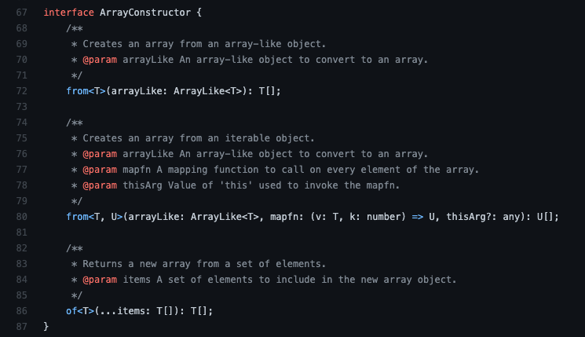

프로그래밍 언어에서 일반적으로 `타입`은 데이터가 메모리에 어떻게 저장될지를 결정하는 `자료형`을 의미합니다. 타입이라는 개념은 단순히 자료형을 의미하는 개념일 뿐만 아니라 컴퓨터 과학에서 `타입 이론`으로 연구되는 분야의 핵심이기도 합니다. 이번 포스트에서는 이 타입 시스템에 대해서 이야기를 해보려 합니다.

## 타입

흔히 _자바스크립트는 타입이 없다_ 라고 말합니다. 하지만 엄밀하게 말하면 이는 틀린 말입니다. 자바스크립트는 동적 타이핑 검사를 합니다. 그럼 동적 타이핑은 무엇일까요?

### 동적 타이핑 vs 정적 타이핑

동적 타이핑은 런타임에, 정적 타이핑은 컴파일 타임에 프로그램의 타입 검사를 진행합니다. 정적 타입 언어에는 C/C++, Java, C# 등이 있고, 동적 타입 언어에는 Python, Javascript, Ruby 등이 있습니다. 정적 타입 언어는 컴파일 타임에 타입을 체크하므로 프로그램의 안정성이 높아지는 장점이 있고, 동적 타입 언어는 자료형의 제약이 비교적 약하기 때문에 유연한 코드를 작성할 수 있다는 장점이 있습니다.

하지만 이렇게 유연함을 허용하면, 프로그래머가 의도하지 않은 결과를 낼 확률 역시 증가합니다. 프로그램이 실행되기 전까지 잘못을 알아차리기 힘들기 때문입니다. 큰 규모의 프로젝트라면 동적 타이핑의 단점은 더 크게 다가올 것입니다. 이러한 이유 때문에 자바스크립트에도 정적 타이핑을 도입하기 위한 많은 시도가 이루어졌습니다. 이는 [자바스크립트로 컴파일되는 언어 목록](https://github.com/jashkenas/coffeescript/wiki/List-of-languages-that-compile-to-JS)만 봐도 자바스크립트에 정적 타입 시스템을 도입하기 위해 얼마나 많은 프로젝트가 진행되었는지 알 수 있습니다.

그중에서 두가지 타입 시스템을 살펴보겠습니다.

## flow

`flow`는 2014년에 페이스북이 발표한 정적 타입 체커입니다. 소스코드 파일의 가장 첫 줄에 주석으로 `@flow`를 추가하면 flow가 그 코드의 타입을 체크하고, 올바르지 않은 코드라면 에러를 발생시키는 구조입니다. 우리는 flow 덕분에 아래와 같은 코드를 사용할 수 있습니다.

```javascript
// @flow
class Foo { ... }

const foo: Foo = new Foo(...);
```

위처럼 클래스 역시 하나의 타입으로 보고 변수의 타입으로 선언할 수도 있습니다. 이는 c++이나 java에서의 타입 지정과 비슷합니다.

```javascript
// @flow
class Parent { ... }
class Child extends Parent { ... }

const foo: Parent = new Child();
const foo: Child = new Child();
```

```javascript
// @flow
type NumsOrStrings = Array<number | string>;

const strings: Array<string> = ['1', '2'];
const array: NumsOrStrings = strings;
```

하지만 위의 코드와 같이 부모 클래스 타입을 가지는 변수에 자식 클래스를 할당하거나, 더 포괄적인 타입에 더 구체적인 타입을 대입하려 할 때에는 이것을 어디까지 허용해야 타입 시스템이 에러를 줄일 수 있을까? 같은 고민이 생깁니다. 이때 필요한 개념이 `type variance` 입니다.

## type variance

type variance는 **어떤 타입을 대체해서 사용할 수 있는 타입을 결정**합니다. 여기에는 `Invariance`, `Covariance`, `Contravariance`, `Bivariance`의 네 가지 종류가 있습니다.

- `Invariance`는 어떤 타입에는 그 타입만이 들어가야 함을 의미합니다.
- `Covariance`는 어떤 타입의 자리에는 그 타입의 subtype을 허용하고, supertype을 허용하지 않습니다.
- `Contravariance`는 그 타입의 supertype을 허용하고, subtype을 허용하지 않습니다.
- 마지막으로 `Bivariance`는 그 타입의 supertype과 subtype 모두를 허용합니다.

위의 Parent, Child 예제에서, Child는 Parent를 상속받습니다. 따라서 _Parent 타입은 less specific 하고 Child 타입은 more specific 하다_ 고 할 수 있습니다. more specific 한 타입이 더 작은 개념이므로 Child 는 Parent 타입의 subtype이 되고, Parent 는 Child 타입의 supertype 이 됩니다. flow의 [공식 문서](https://flow.org/en/docs/lang/variance/)에 따르면, flow는 함수의 입력에 해당하는 파라미터는 `Contravariant`하게 동작하고, 함수의 출력에 해당하는 리턴타입은 `Covariant`하게 동작한다고 합니다.

```javascript
//@flow
class Parent {
  /* ... */
}
class Child extends Parent {
  /* ... */
}

function f1(x: Parent): Parent {
  /* ... */
}
function f2(x: Parent): Child {
  /* ... */
}
function f3(x: Child): Parent {
  /* ... */
}
function f4(x: Child): Child {
  /* ... */
}

const p: Parent = new Parent();
const c: Child = new Child();

const res1: Parent = f1(p); // ok
const res2: Parent = f2(p); // ok
const res3: Parent = f3(c); // ok
const res4: Parent = f4(c); // ok

const res5: Child = f1(p); // ERROR
const res6: Child = f2(p); // ok
const res7: Child = f3(c); // ERROR
const res8: Child = f4(c); // ok
```

예제와 같이 함수의 입력은 Contravariant 하게 동작하므로, Child 자리에는 Child 타입의 supertype인 Parent가 허용됩니다. 따라서 f1, 2, 3, 4 모두 Parent 를 넣던, Child 를 넣던 정상적으로 동작합니다. 하지만 함수의 출력은 Covariant 하게 동작하므로, Child 타입을 반환하는 함수의 결과를 Parent 타입 변수에 할당하려 하면 에러가 발생합니다.

사실 이것은 생각해보면 당연합니다. Child가 가지는 데이터는 Parent 에는 없을 수 있고, Parent 가 가지는 데이터는 Child가 모두 가지고 있기 때문에 함수 내부에서 Child 타입은 Parent 타입이 할 수 있는 모든것을 커버할 수 있기 때문에 supertype이 허용되고(Contravariance), 함수가 반환하는 값이 Parent 라면 Child 타입 변수가 기대하는 모든 것을 처리할 수 없기 때문에 more specific 한 타입인 subtype이 허용됩니다(Covariance).

그런데 사실 이것은 당연하지 않습니다. 타입스크립트에서는 함수 파라미터의 타입 체크가 flow와 같은 방식으로 동작하지 않습니다.

## typescript

[타입스크립트 playground](typescriptlang.org/play)에서 flow 에서 언급한 Parent-Child 예제를 입력해보면 아무 곳도 에러가 나지 않습니다. subtype 에 해당하는 Child 클래스에 Parent 가 가지지 않는 필드를 넣어줘야 그제서야 에러를 내뿜습니다.

```typescript
class Parent {
  /* ... */
}
class Child extends Parent {
  /* ... */
}

function f(): Parent {
  /* ... */
}
const res: Child = f(); // ok
```

```typescript
class Parent {
  /* ... */
}
class Child extends Parent {
  x = 10; /* ... */
}

function f(): Parent {
  /* ... */
}
const res: Child = f(); // ERROR
```

이 부분은 사실은 Covariance 와 관계된 개념은 아니고, `Nominal vs Structural typing`이라는 개념으로 인한 현상입니다.

### Nominal Typing vs Structural Typing

`Nominal typing`은 타입의 이름이 다르다면 아예 다른 타입으로 취급합니다. 이를 따르는 언어는 C++, Java 등이 있습니다. 반면 `Structural typing`은 타입의 이름이 다르더라도, 그 구조가 같다면 같은 타입으로 취급합니다. 이를 따르는 언어는 Ocaml, Haskell 등의 언어가 있습니다.

```typescript
// nominal typing
class Foo {
  f(x: string) {
    /* ... */
  }
}
class Bar {
  f(x: string) {
    /* ... */
  }
}

const foo: Foo = new Bar(); // Error: Foo에 Bar 타입을 할당하려고 하므로 nominal type에서는 에러 발생
```

```typescript
// structural typing
class Foo {
  f(x: string) {
    /* ... */
  }
}
class Bar {
  f(x: string) {
    /* ... */
  }
}

const foo: Foo = new Bar(); // OK: 서로 다른 타입이라도 structural type에서는 구조가 같으므로 에러 발생X
```

타입스크립트에서는 class 타입은 structural typing 을 따르기 때문에 Parent와 Child의 구조가 같은 첫번째 예제에서는 에러가 발생하지 않고, Child의 프로퍼티를 추가한 두번째 예제에서는 에러가 발생합니다. 반면 flow의 class 타입은 nominal typing을 따르기 때문에, 구조가 같더라도 다른 타입으로 인식해 에러를 발생시킵니다. 이때 typescript 역시 함수의 리턴타입은 more specific 한 subtype만을 허용하는 Covariant 한 성질을 확인할 수 있습니다. 개인적으로 타입스크립트의 타입 시스템은 괴상한 문법이 많이 있지만 결국엔 함수와 객체 뿐 아니라 클래스까지 structural typing 을 따르기 때문에 자바스크립트의 duck typing을 컴파일 타임에 검사해주는 것에 불과한 느낌을 받았습니다.

## Bivariance

지금까지 flow와 타입스크립트에서 함수의 파라미터와 리턴타입이 각각 Contravariant, Covariant 하게 동작하는 것을 확인했습니다. 그렇다면 Bivariance 는 무엇이고, 왜 존재하는 걸까요?

```typescript
type Event = MouseEvent | KeyboardEvent;
type Handler<T> = (e: T) => void;

// OK
let handler: Handler<Event> = (e: Event) => {
  console.log('event', e);
};

// OK
handler = (e: MouseEvent | KeyboardEvent | TouchEvent) => {
  console.log('event', e);
};

// ERROR
handler = (e: MouseEvent) => {
  console.log('event', e);
};
```

마지막줄의 handler에 MouseEvent만을 파라미터로 받는 함수를 할당하는 코드는 에러를 발생시킵니다. 원래 handler는 MosueEvent와 KeyboardEvent를 커버할 수 있는 함수인데, 여기에 MouseEvent만을 커버할 수 있는 함수를 할당해버리면 안되기 때문입니다. 하지만 타입스크립트에서는 이것을 허용하도록 할 수 있습니다. 이는 곧 함수의 파라미터를 Bivariant 하게 동작하도록 할 수 있다는 말과 동일합니다. 타입스크립트 컴파일러의 플래그 중 `strictFunctionTypes`를 끄면 가능합니다. 일반적인 경우에 less specific 한 타입을 받는 Covariance 가 좀 더 `type-safe`하지만, 컴파일러 옵션에 strictFunctionTypes 플래그가 생기기 이전까지 타입스크립트에 Bivariance를 허용해야 하는 이유가 있었습니다. **아래 코드와 설명은 [레퍼런스](https://seob.dev/posts/%EA%B3%B5%EB%B3%80%EC%84%B1%EC%9D%B4%EB%9E%80-%EB%AC%B4%EC%97%87%EC%9D%B8%EA%B0%80/)를 참고했습니다**.

```typescript
interface Array<T> {
  ...
  push(...item: T[]): number;
  ...
}
```

Array 타입에는 push 메소드가 존재합니다. `Array<string>` 타입의 push 메소드는 `(...item: string[]) => number` 타입이고, `Array<number | string>` 타입의 push 메소드는 `(...item: (number | string)[]) => number` 타입입니다. 하지만 가만히 생각해보면 `string` 타입에 비해 `number | string` 타입이 less specific 하므로 `Array<string>.push` 의 자리에 `Array<number | string>.push`가 들어갈 수 없습니다. `Array<string>`에 number 타입이 들어갈 수 있으면 안되기 때문입니다. 따라서 **`Array<string>` 타입이 `Array<number | string>` 타입의 supertype 이 됩니다**. `string` 타입이 `number | string` 타입의 subtype이 되는 것과 반대입니다.

하지만 직관적으로 봤을 때는 `Array<number | string>`이 `Array<string>`을 포함하는 것 같습니다. 이러한 문제를 해결하기 위해 Scala 와 같은 언어에서는 아래와 같이 제네릭에서 Convariance/Contravariance를 명시해주는 문법이 있다고 합니다. 하지만 타입스크립트에서는 이러한 문법이 없어 `type-safety`를 조금 희생하고, 위의 Array와 같은 케이스를 위해 Bivariance를 선택한 것으로 보입니다.

```scala
case class Foo[+T] // T는 covariant
case class Foo[-T] // T는 contravriant
```

## strictFunctionTypes vs non-strictFunctionTypes

보통 우리는 타입스크립트를 사용할 때, strictFunctionTypes 플래그를 켜놓고 사용합니다. 그게 타입스크립트 컴파일러의 default 옵션이니까요. 하지만 생각해보면, 이런 문제가 굳이 생겼던 적은 없었던 것 같습니다.

다음과 같은 인터페이스를 생각해보겠습니다.

```typescript
interface Store<T> {
  set: (item: T) => void;
}

const store: Store<number | string> = {
  // ERROR
  set(item: number) {
    /* ... */
  },
};
```

함수의 파라미터는 Contravariant 하게 동작하기 때문에 `number | string` 타입의 subtype 인 `number` 를 사용하면 에러가 발생하게 됩니다. 하지만 여기서 set 메소드의 타입을 조금만 바꿔주면 에러를 없앨 수 있습니다.

```typescript
interface Store<T> {
  set(item: T): void;
}

const store: Store<number | string> = {
  // OK
  set(item: number) {
    /* ... */
  },
};
```

놀랍게도 `set: (item: T) => void` 에서 `set(item: T): void`로만 바꿔줬는데, 에러가 발생하지 않습니다. 아까 `Array<T>`와 같이 직관적으로 봤을 때 Covariant하게 동작해야 할 것 같은 것들이 있었습니다. 이러한 녀석들은 Covariant 하게 동작했으면 좋겠으나, 함수의 파라미터는 Contravariant 하게 동작해야 하므로 이를 지원하기 위해 의도적으로 추가한 문법이 바로 이것이라고 합니다.

정리하자면, **`set(item: T): void`는 함수의 파라미터가 Bivariant 하게 동작하도록 하고, `set: (item: T) => void`는 함수의 파라미터가 Contravariant하게 동작하도록 합니다**.

실제로 깃허브의 타입스크립트 저장소에 선언된 타입선언 파일들에도 메소드들이 `set(item: T): void` 와 같은 형식으로 저장되어 있어, Bivariant 하게 동작합니다.



사실 flow에는 scala와 비슷하게 covariance/contravariance를 지정해주는 문법이 따로 있습니다. 왜 타입스크립트에는 이런 문법을 도입하지 않았는지 의문이네요.

```typescript
// @flow
type GenericBox<T> = T;

let x: GenericBox<number> = 1;
// () 안에 있는것은 타입 캐스팅, 에러가 발생하므로 타입 캐스팅이 불가능함을 의미
// ERROR
(x: GenericBox<number | string>); // 기본적으로 제네릭은 invariant

```

```typescript
// @flow
type GenericBox<+T> = T; // covariance sigil

let x: GenericBox<number> = 1;
// OK
(x: GenericBox<number | string>); // covariance, subtype을 허용
```

```typescript
// @flow
type GenericBox<-T> = T => void; // contravariance sigil, contravariant한 상황에만 사용가능하기 때문에 함수의 파라미터로 사용

let x: GenericBox<number | string> =
  (x: number | string) => console.log(3);
(x: GenericBox<number>); // contravariance, supertype을 허용
```

## 마치며

지금까지 자바스크립트에 타입 시스템을 도입하려는 노력과, 그 과정에서 타입에 대한 엄밀한 이해를 위해 `Type Variance` 와 `Nominal, Structural Typing`이라는 개념에 대해 알아봤습니다. 솔직히 여기까지 글을 쓰면서도 `Type Variance`는 정확하게 이해했다고 하지 못할 것 같습니다. 그래서인지 글도 뒤죽박죽 어수선하게 쓰여진 것 같습니다. `Type Variance`를 완전히 이해하진 못하더라도 `type-safe`한 코드를 작성하기 위해서 필요한 정도는 알아두는게 좋을것 같습니다.

개인적으로 flow의 타입 검사가 상당히 마음에 들었습니다. 타입스크립트에서 지원하는 `keyof`, `ReturnType` 등의 유틸리티 타입도 독자적인 형태로 지원하고 있으니, 관심있으신 분은 알아봐도 좋겠습니다.

## 레퍼런스

wikipedia - programming language: [https://en.wikipedia.org/wiki/Programming_language#Type_system](https://en.wikipedia.org/wiki/Programming_language#Type_system)  
list of languages that compile to js: [https://github.com/jashkenas/coffeescript/wiki/List-of-languages-that-compile-to-JS](https://github.com/jashkenas/coffeescript/wiki/List-of-languages-that-compile-to-JS)  
flow docs - type variance: [https://flow.org/en/docs/lang/variance/](https://flow.org/en/docs/lang/variance/)  
type variance - why it matters: [http://www.dreadedsoftware.com/blog/2016/6/4/type-variance-why-it-matters](http://www.dreadedsoftware.com/blog/2016/6/4/type-variance-why-it-matters)  
wikipedia - subtyping: [https://en.wikipedia.org/wiki/Subtyping](https://en.wikipedia.org/wiki/Subtyping)  
typescript docs - TypeScript 2.6: [https://www.typescriptlang.org/docs/handbook/release-notes/typescript-2-6.html](https://www.typescriptlang.org/docs/handbook/release-notes/typescript-2-6.html)  
공변성이란 무엇인가: [https://seob.dev/posts/%EA%B3%B5%EB%B3%80%EC%84%B1%EC%9D%B4%EB%9E%80-%EB%AC%B4%EC%97%87%EC%9D%B8%EA%B0%80/](https://seob.dev/posts/%EA%B3%B5%EB%B3%80%EC%84%B1%EC%9D%B4%EB%9E%80-%EB%AC%B4%EC%97%87%EC%9D%B8%EA%B0%80/)  
TS docs - Type Compatibility: [https://www.typescriptlang.org/ko/docs/handbook/type-compatibility.html](https://www.typescriptlang.org/ko/docs/handbook/type-compatibility.html)
