## 개요

오늘의 주제는 `CORS` 입니다

이전부터 CORS가 무엇인지는 어렴풋이 알고 있었지만, 항상 프레임워크에서 제공하는 cors 설정 모듈만 만져왔습니다

이번 글에서는 실제로 CORS 관련 헤더가 동작하는것을 확인해보고 그 결과를 공유합니다

## 서버 구성

우선 요청을 처리할 서버를 만들어 보겠습니다

이번 실습에서 요청에 대한 응답을 보내줄 역할을 하는 간단한 서버입니다

`/`로 요청을 보내면 문자열 `hello`를 반환하도록 구성했습니다

```go
package main

import (
	"fmt"
	"net/http"
)

var PORT = 8080

func main() {
	http.HandleFunc("/", helloHandler)
	quit := make(chan bool, 1)

	go func(chan bool) {
		err := http.ListenAndServe(fmt.Sprintf(":%d", PORT), nil)
		if err != nil {
			panic(err)
		}
		quit <- true
	}(quit)

	fmt.Printf("Listening on port %d\n", PORT)
	<-quit
}

func helloHandler(w http.ResponseWriter, req *http.Request) {
	w.Header().Add("Content-Type", "text/plain; charset=utf-8")
	w.Write([]byte("hello"))
}
```

## CORS (Cross Origin Resource Sharing)

CORS는 잘 알다시피 한 애플리케이션이 다른 출처의 리소스에 접근할 수 있는 권한을 부여하도록 브라우저에 알려주는 시스템입니다

웹 애플리케이션은 리소스의 출처가 자신의 출처와 다르다면(프로토콜, 도메인, 포트 중 하나라도 다른 경우) Cross Origin HTTP 요청을 보냅니다

위 서버를 8080번 포트에 띄우고, 5000번 포트에서 루트 경로로 리소스(hello 문자열)을 요청해보겠습니다

```jsx
// index.html
<!DOCTYPE html>
<html lang="en">
<head>
  <meta charset="UTF-8">
  <title></title>
</head>
<body>
<script>
  fetch("http://localhost:8080")
      .then(res => res.text())
      .then(data => console.log(data));
</script>
</body>
</html>

// bash
$ npx serve .
```

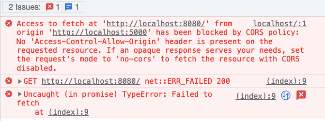

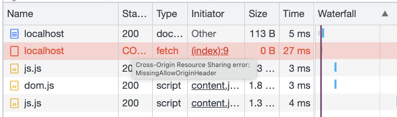

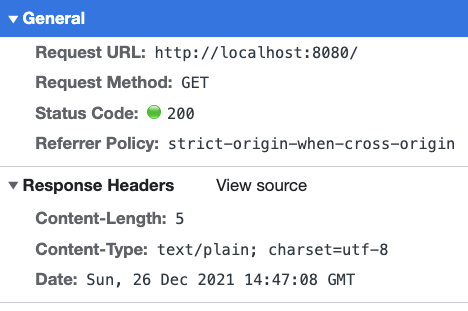

응답 헤더에는 응답코드 200으로 정상적인 결과를 받아옵니다

하지만 브라우저에서 CORS 정책때문에 응답 결과를 사용하지 않고 버리고 있습니다

서버쪽에 헤더를 하나 추가해보겠습니다

```go
func helloHandler(w http.ResponseWriter, req *http.Request) {
	w.Header().Add("Access-Control-Allow-Origin", "http://localhost:5000")
	w.Header().Add("Content-Type", "text/plain; charset=utf-8")
	w.Write([]byte("hello"))
}
```

Content-Type 헤더에 이어 `Access-Control-Allow-Origin` 헤더를 추가했습니다

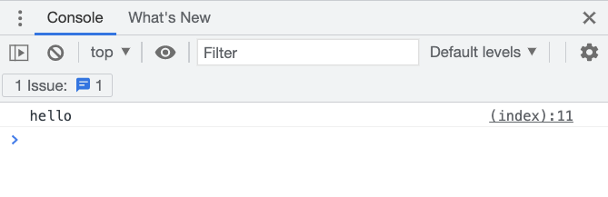

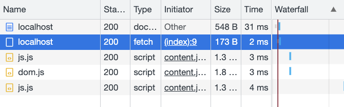

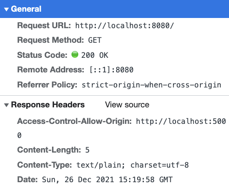

응답 결과 자체는 동일하지만 응답 헤더에 `Access-Control-Allow-Origin`을 추가하니 응답 결과를 정상적으로 사용할 수 있었습니다

그럼 5000번 포트가 아닌 5001번 포트에서 서버로 요청을 보내보겠습니다

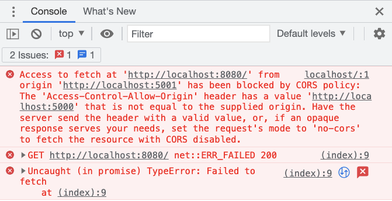

이번에는 `Access-Control-Allow-Origin`헤더는 있지만, origin과 다르다는 에러 메시지를 보여줍니다

그럼 CORS가 실제로 어떻게 동작하는지 알아보겠습니다

## Preflight request

브라우저는 Cross Origin HTTP 요청 전에 서버 측에 그 요청의 메소드와 헤더에 대해 인식하고 있는지를 체크하는 사전 요청(Preflight request)을 보냅니다

이 사전 요청은 `simple request`가 아닌 일부 요청들에 의해 트리거됩니다

이 simple request의 조건은 mdn에 아래와 같이 명시되어 있습니다

- `GET`, `HEAD`, `POST` 요청 중 하나
- User Agent 가 자동으로 설정한 헤더를 가지는 요청
    
    → `Accept`, `Accept-Language`, `Content-Language`, `Content-Type`이 해당
    
- Content-Type 헤더를 사용할 경우엔 해당 내용이 `application/x-www-form-urlencoded`, `multipart/form-data`, `text/plain`중 하나인 요청
- `XMLHttpRequestUpload` 객체에 이벤트 리스너가 등록되어 있지 않은 요청
- `ReadableStream` 객체가 사용되지 않은 요청

이러한 요청이 아닐 경우 브라우저는 서버에 사전 요청을 보내게 됩니다

4번 5번 조건의 경우에는 직접 XMLHttpRequest 객체를 조작할 것이 아니라면 크게 신경쓰지 않아도 돼보입니다

simple request 에서 벗어나기 위해 위에서 사용한 요청 예제 중 마지막 케이스에 헤더를 하나 추가해보겠습니다

```go
fetch('http://localhost:8080', { headers: { 'Content-Type': 'application/json' } })
      .then(res => res.text())
      .then(data => console.log(data));
```

요청 헤더에 Content-Type 속성을 줘서 위의 simple request에 해당하지 않는 요청이 되었습니다

이러한 요청은 simple request와 다르게 다른 도메인의 리소스로 사전 요청을 먼저 보내 실제 요청이 전송하기에 안전한지 확인합니다

사전 요청이 정상적으로 생성되어서 전송되었는지 보겠습니다

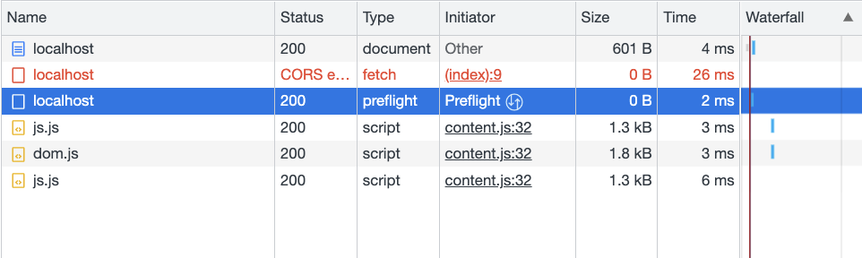

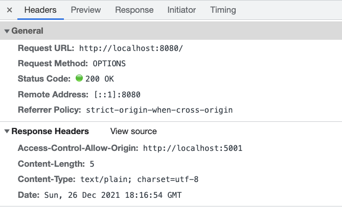

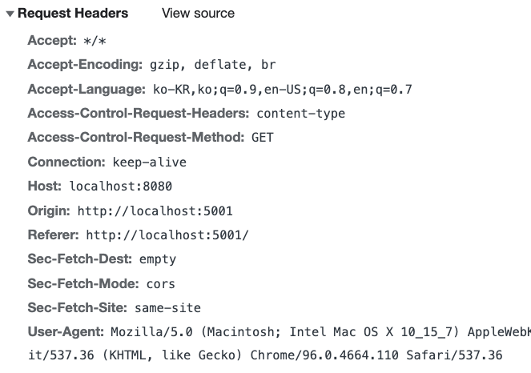

`OPTIONS` 메소드를 통해 사전 요청을 만들어 서버로 보내고 있습니다

또한 요청 헤더의 `Origin` 에 현재 요청을 보내는 도메인을 함께 보내고, `Access-Control-Request-Method`에 요청 메소드인 GET을 보내고 있습니다

하지만 문제가 하나 있습니다

서버에서 보내준 Access-Control-Allow-Origin 헤더가 요청을 보내는 도메인과 일치하지만, 브라우저에서는 CORS 정책 위반으로 응답 데이터를 버리고 있습니다

이를 해결하기 위해선 `Access-Control-Allow-Headers`라는 헤더가 하나 더 필요합니다

요청에 허용하지 않던 Content-Type 헤더를 추가했기 때문입니다

서버에 Content-Type 요청 헤더를 허용하겠다는 헤더를 추가해주겠습니다

```go
func helloHandler(w http.ResponseWriter, req *http.Request) {
	w.Header().Add("Access-Control-Allow-Origin", "http://localhost:5001")
	w.Header().Add("Access-Control-Allow-Headers", "Content-Type")
	w.Header().Add("Content-Type", "text/plain; charset=utf-8")
	w.Write([]byte("hello"))
}
```

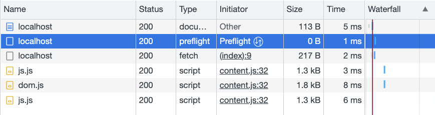

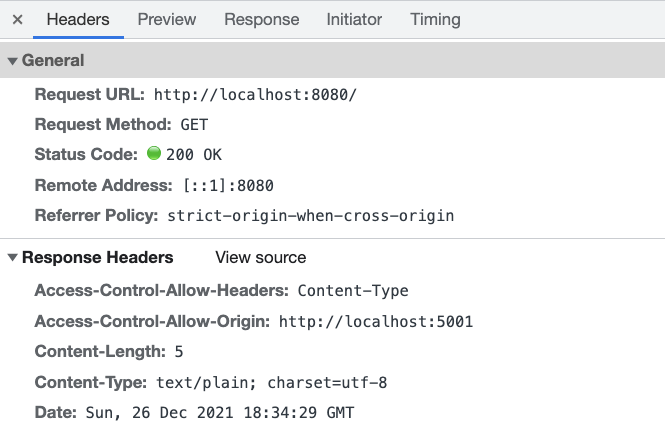

사전 요청도 정상적으로 이뤄졌고, fetch 결과 역시 이상없이 받을 수 있었습니다

이번엔 simple request 에 해당되지 않는 다른 조건을 위해 PATCH 요청을 보내보겠습니다

```go
fetch("http://localhost:8080", {
  headers: { "Content-Type": "application/json" },
  method: 'PATCH'
})
  .then((res) => res.text())
  .then((data) => console.log(data));
```

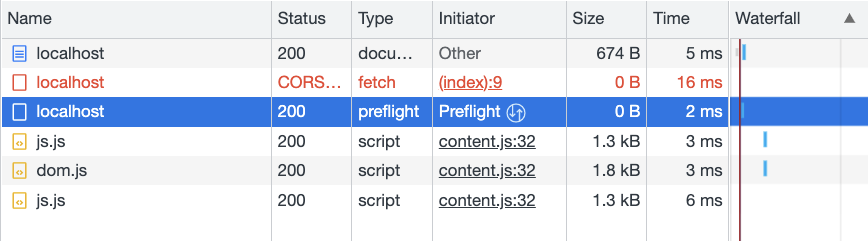

다행히도(?) CORS 에러가 발생했습니다

이러한 경우를 해결하기 위해서는 `Access-Control-Allow-Methods` 헤더가 필요합니다

역시 서버에 응답 헤더를 추가해주겠습니다

```go
func helloHandler(w http.ResponseWriter, req *http.Request) {
	w.Header().Add("Access-Control-Allow-Origin", "http://localhost:5001")
	w.Header().Add("Access-Control-Allow-Headers", "Content-Type")
	w.Header().Add("Access-Control-Allow-Methods", "PATCH")
	w.Header().Add("Content-Type", "text/plain; charset=utf-8")
	w.Write([]byte("hello"))
}
```

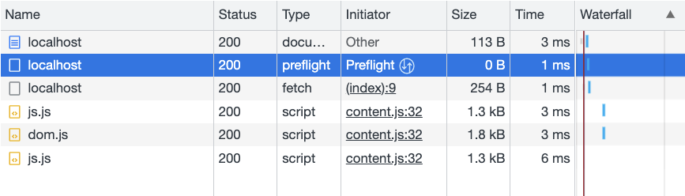

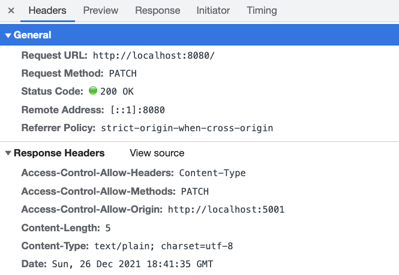

이번에도 해당 헤더를 추가했더니 이상없이 요청이 처리되었습니다

## Credentials

일반적으로 웹 앱이 서버와 통신할 때 사용자의 인증정보를 이용하기 위해 쿠키나 토큰을 함께 보냅니다

하지만 Cross Origin 요청의 경우 쿠키를 요청에 실어보내기 위해선 또다른 조치가 필요합니다

우선 `http://localhost:5001`페이지에서 쿠키를 하나 생성하고, 서버에서 이를 읽을 수 있는지 확인하겠습니다

서버에 요청에 실려온 쿠키를 로깅하는 코드를 추가해줍니다

```go
func helloHandler(w http.ResponseWriter, req *http.Request) {
	for _, v := range req.Cookies() {
		fmt.Println(v)
	}

	w.Header().Add("Access-Control-Allow-Origin", "http://localhost:5001")
	w.Header().Add("Access-Control-Allow-Headers", "Content-Type")
	w.Header().Add("Access-Control-Allow-Methods", "PATCH")
	w.Header().Add("Content-Type", "text/plain; charset=utf-8")
	w.Write([]byte("hello"))
}
```

5001번 포트에서 쿠키를 추가하고 요청을 보내면 서버의 로그에는 아무것도 찍히지 않습니다

이것은 브라우저가 Cross-site 요청에 대해 자격 증명 정보를 보내지 않기 때문입니다

이 정보를 요청과 함께 보내기 위해선 특정 플래그를 추가해줘야 합니다

```go
// cookie: hello=world; my=cookie;
fetch("http://localhost:8080", {
  headers: { "Content-Type": "application/json" },
  method: 'PATCH',
  credentials: "include",
})
  .then((res) => res.text())
  .then((data) => console.log(data));
```

`credentials: “include”` 를 통해 브라우저에 저장된 자격 증명 정보를 함께 보낼 수 있습니다

그럼 이제 서버의 로그에는 브라우저에서 설정한 쿠키값들이 보여야 할 것입니다

하지만 로그에는 아무것도 보이지 않고, 브라우저의 콘솔창에도 뭔가 나타났습니다

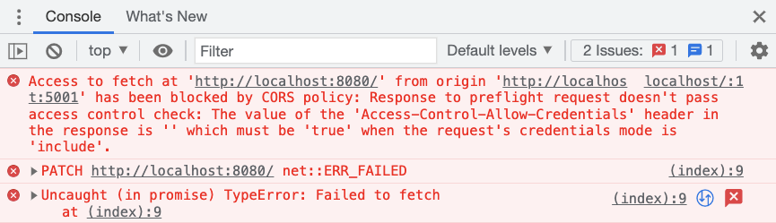

이때 필요한 헤더는 `Access-Control-Allow-Credentials` 입니다

이 헤더는 특정 값이 아니라 `true`를 set 해주면 됩니다

서버의 코드에 추가해줍니다

```go
func helloHandler(w http.ResponseWriter, req *http.Request) {
	for _, v := range req.Cookies() {
		fmt.Println(v)
	}

	w.Header().Add("Access-Control-Allow-Origin", "http://localhost:5001")
	w.Header().Add("Access-Control-Allow-Headers", "Content-Type")
	w.Header().Add("Access-Control-Allow-Methods", "PATCH")
	w.Header().Add("Access-Control-Allow-Credentials", "true")
	w.Header().Add("Content-Type", "text/plain; charset=utf-8")
	w.Write([]byte("hello"))
}
```

해당 헤더를 추가해주니 역시 이상없이 응답을 받아오고, 서버의 로그에도 이상없이 쿠키값이 출력됩니다

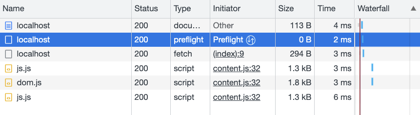

## Cache

마지막으로 사전 요청의 캐싱을 알아보겠습니다

브라우저는 응답의 `Access-Control-Max-Age` 헤더를 통해 사전 요청의 캐싱을 관리합니다

해당 헤더에 지정된 숫자만큼의 초 동안 사전 요청 없이 Cross Origin 요청을 보낼 것인지 결정합니다

이를 위해 1초마다 Cross Origin 요청을 보내도록 클라이언트 코드를 수정하겠습니다

```go
setInterval(() => {
  fetch("http://localhost:8080", {
    headers: {
      "Content-Type": "application/json",
    },
    method: "PATCH",
    credentials: "include",
  })
    .then((res) => res.text())
    .then((data) => console.log(data));
}, 1000); 
```

처음에는 서버에 Max Age 를 주지 않고 사전 요청이 어떻게 전송되는지 확인해보겠습니다

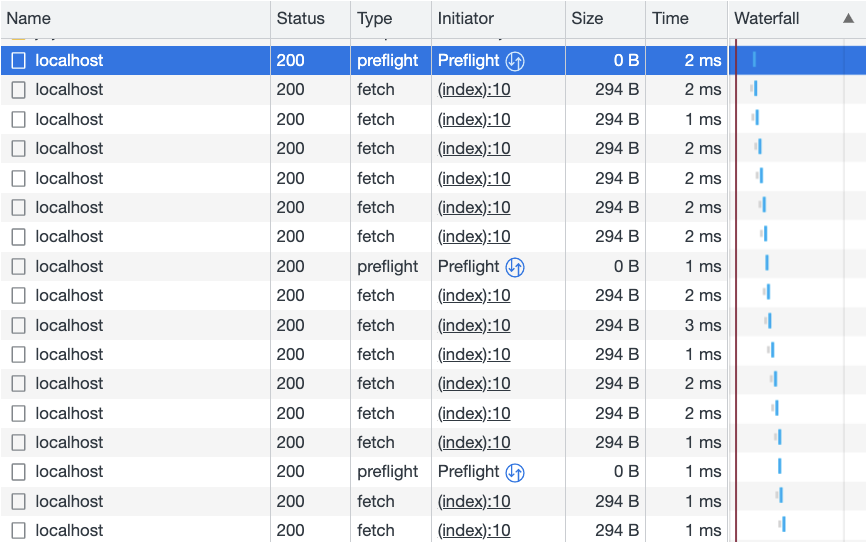

6회의 본 요청마다 사전 요청을 한번씩 보내고 있으니, Max Age가 6이라고 생각해도 될 것 같습니다

그럼 서버의 응답에 Max Age 헤더에 2라는 값을 주고 요청을 보내보겠습니다

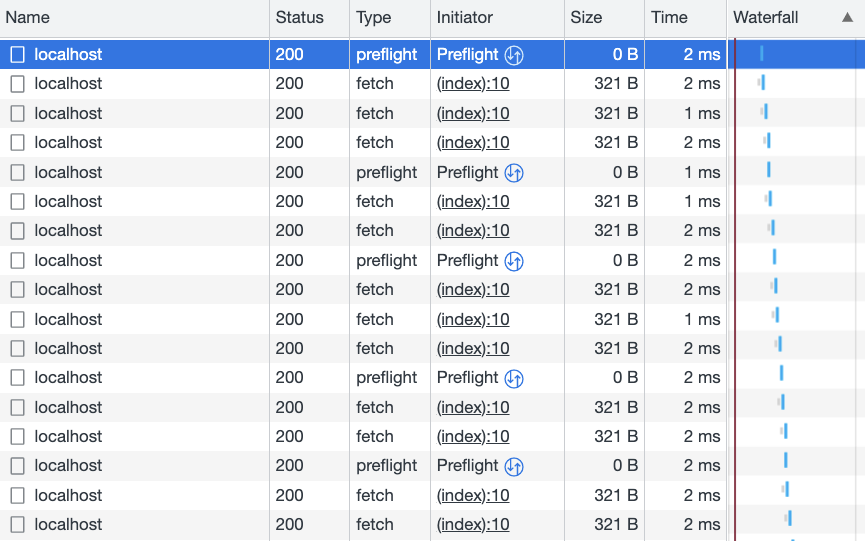

2 - 3회의 본 요청마다 사전 요청을 한번씩 보내고 있으니 `setInterval`함수의 오차를 고려하면 잘 동작한다고 볼 수 있습니다

사전 요청의 캐싱을 제어하고 싶다면 `Access-Control-Max-Age` 헤더를 설정해주면 되겠습니다

## 마무리

지금까지 Cross Origin 요청과 해당 요청에 필요한 http 헤더를 알아봤습니다

유명한 백엔드 프레임워크들은 이러한 헤더를 자동으로 세팅해주는 미들웨어를 제공하니 사실 이것들을 사용하면 편하게 개발할 수 있습니다

흔히 사용되는 expressjs의 cors 미들웨어 라이브러리도 거창한 것이 아니라 옵션으로 전달되는 객체 데이터를 헤더에 넣어주는 역할이 전부입니다

하지만 실력있는 개발자가 되기 위해선 단순히 라이브러리를 갖다 쓰는 것에 그치지 않고, 이러한 것들이 어떻게 동작하는지 알아야 할 것입니다

## 레퍼런스

[https://ko.javascript.info/fetch-crossorigin](https://ko.javascript.info/fetch-crossorigin)

[https://developer.mozilla.org/ko/docs/Web/HTTP/CORS](https://developer.mozilla.org/ko/docs/Web/HTTP/CORS)

[https://github.com/expressjs/cors/blob/master/lib/index.js](https://github.com/expressjs/cors/blob/master/lib/index.js)
