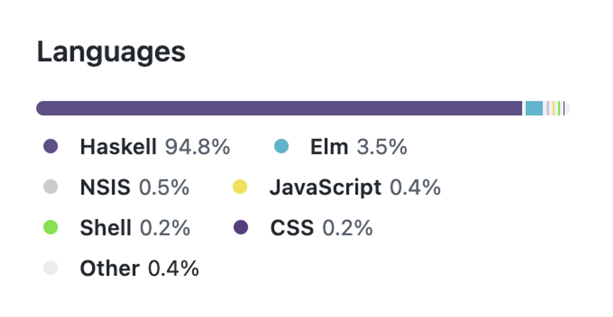
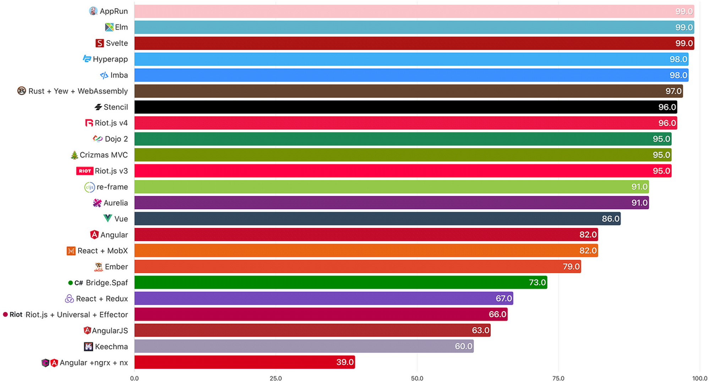
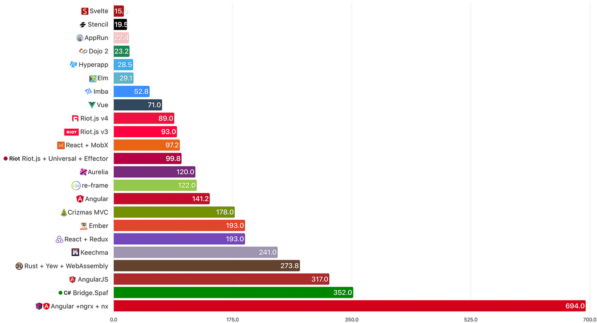
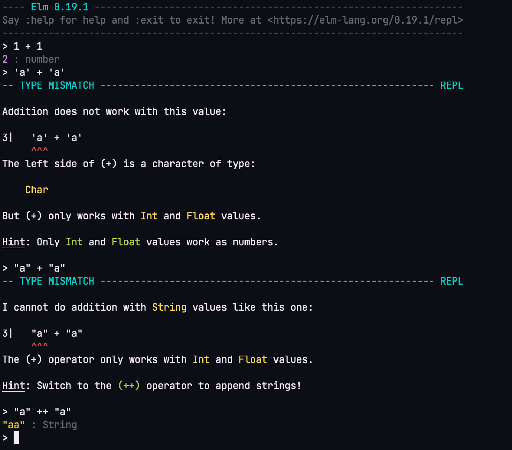
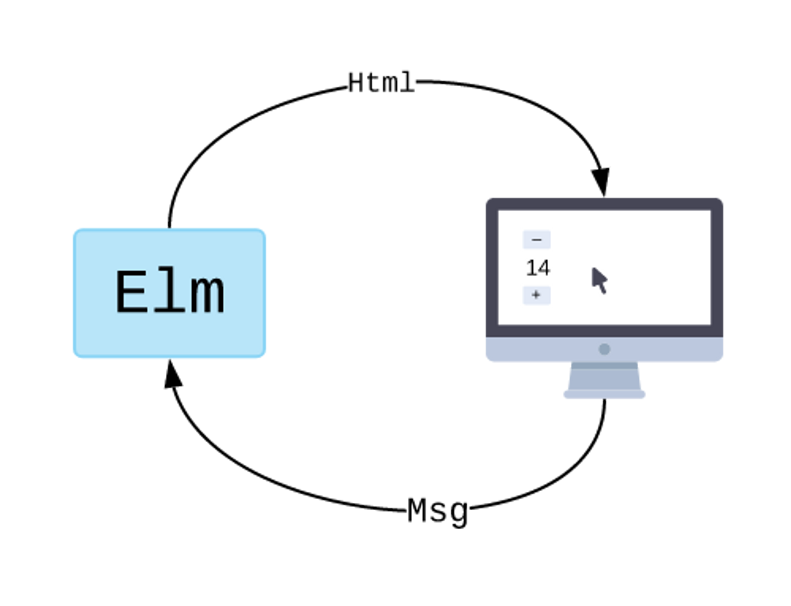

## 개요

1995년 자바스크립트의 탄생 이래로 웹 브라우저와 자바스크립트는 떼려야 뗄 수 없는 관계로 발전해왔습니다

jQuery, Angular, React, Vue, Svelte 등등 지금까지 프론트엔드 생태계는 대부분 자바스크립트에 기반하여 발전해왔습니다

현재 인기있는 타입스크립트 역시 자바스크립트에 기반하고 있습니다

이번 포스트에서는 이러한 자바스크립트 중심의 프론트엔드 생태계에서 벗어나 새로운 시도를 했던 기술 몇가지를 소개하려 합니다

# ReScript


ReScript는 2020년에 발표된 자바스크립트로 컴파일되는 함수형 프로그래밍 언어입니다

ReScript의 근원은 함수형 프로그래밍 언어 `OCaml`로부터 시작됩니다

OCaml의 [강력한 타입 시스템](https://en.wikipedia.org/wiki/Hindley%E2%80%93Milner_type_system)을 자바스크립트에서 사용하기 위해 시작된 Reason이라는 프로젝트를 시작으로, ReScript는 Reason으로부터 리브랜딩되어 별개의 프로젝트로 떨어져나오게 됩니다

[언어의 컴파일러](https://github.com/rescript-lang/rescript-compiler) 역시 OCaml로 작성되었고, 표준 라이브러리에서도 OCaml의 철학이 묻어나옵니다


## vs 타입스크립트

분명 ReScript의 포지션은 타입스크립트와 비슷합니다

하지만 둘은 목표하는 바가 다릅니다

ReScript의 공식문서에 따르면 타입스크립트는 자바스크립트의 `Superset`을 목표하여, 자바스크립트의 기능과 문법을 확장합니다

하지만 ReScript는 자바스크립트의 `Subset`을 목표로 하여, 독자적인 문법을 가지고 동작합니다

따라서 ReScript는 타입스크립트보다 가벼울 수 밖에 없고, 그에 따른 빠른 컴파일 속도를 장점으로 가집니다

## 특징

### 성능

간단히 코드를 작성해보겠습니다

```reason
let rec fac = (~acc = 1, x) => {
  switch x {
  | 1 => acc
  | n => fac (~acc = acc * n, n - 1)
  }
}

Js.log(fac (5))
```

위 코드는 아래 자바스크립트 코드로 컴파일됩니다

```jsx
// Generated by ReScript, PLEASE EDIT WITH CARE
'use strict';

function fac(_accOpt, _x) {
  while (true) {
    var accOpt = _accOpt;
    var x = _x;
    var acc = accOpt !== undefined ? accOpt : 1;
    if (x === 1) {
      return acc;
    }
    _x = (x - 1) | 0;
    _accOpt = Math.imul(acc, x);
    continue;
  }
}

console.log(fac(undefined, 5));

exports.fac = fac;
/*  Not a pure module */
```

위 코드에서 주목할만한 점은 꼬리 재귀 최적화가 적용되어 재귀 루프가 while loop으로 바뀌었다는 점입니다

여러 스택 오버플로 답변 ([#1](https://stackoverflow.com/questions/5349425/whats-the-fastest-way-to-loop-through-an-array-in-javascript), [#2](https://stackoverflow.com/questions/43592016/how-do-i-replace-while-loops-with-a-functional-programming-alternative-without-t/43596323))에 따르면 while loop을 이용한 반복이 가장 빠른 성능을 보여줬습니다

또한 곱셈 연산에 `Math.imul`이 사용되었습니다

C언어와 같이 32비트의 정수 곱셈에는 이 함수가 더 빠른 성능을 가진다고 합니다

이렇듯 ReScript는 사소한 곳에도 최적화를 적용해 성능 면에서도 이점을 가지도록 했습니다

### 패턴 매칭

공식 문서의 표현을 빌리자면, 패턴 매칭은 ReScript의 가장 강력하고 효율적인 기능들 중 하나입니다

ReScript의 `switch`문은 자바스크립트에서 `switch`를 사용하는 것과 비슷하지만, `표현식 (expression)`이라는 점이 특징입니다

구문이 표현식이라는 것은 어떠한 값을 반환한다는 것을 의미합니다

따라서 그 값을 변수에 할당할 수도 있고, 함수의 반환값으로 사용할 수도 있습니다

기본적인 switch문은 아래와 같이 생겼습니다

```reason
type coin =
  | Penny
  | Nickel
  | Dime
  | Quarter

let myCoin = Dime

let cent = switch myCoin {
| Penny => 1
| Nickel => 5
| Dime => 10
| Quarter => 25
}

Js.log(cent) // 10
```

위 코드의 `|`는 자바스크립트나 c/c++에서 `case`에 대응됩니다

ReScript의 패턴 매칭의 장점으로 `강력한 destructuring` 이 있습니다

```reason
type status = Vacations(int) | Sabbatical(int) | Sick | Present
type reportCard = {passing: bool, gpa: float}
type person =
  | Teacher({
    name: string,
    age: int,
  })
  | Student({
    name: string,
    status: status,
    reportCard: reportCard,
  })

let person1 = Teacher({name: "Jane", age: 35})

let message = switch person1 {
| Teacher({name: "Mary" | "Joe"}) =>
  `Hey, still going to the party on Saturday?`
| Teacher({name}) =>
  // this is matched only if `name` isn't "Mary" or "Joe"
  `Hello ${name}.`
| Student({name, reportCard: {passing: true, gpa}}) =>
  `Congrats ${name}, nice GPA of ${Js.Float.toString(gpa)} you got there!`
| Student({
    reportCard: {gpa: 0.0},
    status: Vacations(daysLeft) | Sabbatical(daysLeft)
  }) =>
  `Come back in ${Js.Int.toString(daysLeft)} days!`
| Student({status: Sick}) =>
  `How are you feeling?`
| Student({name}) =>
  `Good luck next semester ${name}!`
}
```

위 코드는 아래 자바스크립트 코드로 변환됩니다

```reason
var person1 = {
  TAG: /* Teacher */0,
  name: "Jane",
  age: 35
};

var message;

if (person1.TAG) {
  var match$1 = person1.status;
  var name = person1.name;
  var match$2 = person1.reportCard;
  message = match$2.passing
    ? "Congrats " +
      name +
      ", nice GPA of " +
      match$2.gpa.toString() +
      " you got there!"
    : typeof match$1 === "number"
    ? match$1 !== 0
      ? "Good luck next semester " + name + "!"
      : "How are you feeling?"
    : person1.reportCard.gpa !== 0.0
    ? "Good luck next semester " + name + "!"
    : "Come back in " + match$1._0.toString() + " days!";
} else {
  var name$1 = person1.name;
  switch (name$1) {
    case "Joe":
    case "Mary":
      message = "Hey, still going to the party on Saturday?";
      break;
    default:
      message = "Hello " + name$1 + ".";
  }
}
```

복잡한 if casing 과정을 ReScript가 대신 작성해주고, 개발자는 더 깔끔한 코드로 로직을 표현할 수 있게 됩니다

물론 자바스크립트로 변환될 때 타입 정보는 사라지고 런타임에 필요한 코드만이 남게 되지만 개발 단계에서는 type safety를 챙겨 안전한 개발을 가능하게 합니다

## 인 프로덕션

프로덕션에 사용되는 것으로는 국내 기업 중 [그린랩스](https://green-labs.github.io/rescript-bootcamp)가 유명합니다

사실 프론트엔드 개발을 위한 ReScript는 DOM 조작보단 리액트와 함께 쓰이는 것이 권장됩니다

ReScript 의 뿌리가 페이스북에 있다보니, [공식 리액트 바인딩](https://github.com/rescript-lang/rescript-react)이 존재하기 때문입니다

아래 예제는 ReScript로 구현한 간단한 리액트 컴포넌트입니다

```reason
// src/Button.res
module Button = {
  @react.component
  let make = (~count: int) => {
    let times = switch count {
    | 1 => "once"
    | 2 => "twice"
    | n => Belt.Int.toString(n) ++ " times"
    }
    let msg = "Click me " ++ times

    <button> {msg->React.string} </button>
  }
}
```

언뜻 보기에 코드 구조가 자바스크립트와 크게 다르지 않습니다

ReScript 리액트에서는 make 라는 이름의 함수가 함수 컴포넌트 하나가 됩니다

위 예제에서는 Button 이라는 이름의 모듈로 선언했기 때문에 이 컴포넌트를 다른 파일에서 사용할때 아래와 같이 사용할 수 있습니다

```reason
// src/App.res
@react.component
let make = () => {
  <div>
    <Button count={1}/>
  </div>
}
```

그냥 자바스크립트에서 하던 것과 같습니다

또한 ReScript 프로젝트는 컴파일 성능을 위해 최대한 flat한 구조를 권장합니다

복잡한 UI를 작성하다보면 파일이 여러개 생겨 그렇게 할 수 없는 경우가 많아지는데, ReScript에서는 하위 모듈 기능을 이용해 여러 작은 컴포넌트를 한 파일에 깔끔하게 선언할 수 있습니다

```reason
// src/Button.res
module Label = {
  @react.component
  let make = (~title: string) => {
    <div className="myLabel"> {React.string(title)} </div>
  }
}

@react.component
let make = (~children) => {
  <div>
    <Label title="Getting Started" />
    children
  </div>
}
```

Button.res에 선언된 Label 이라는 컴포넌트는 <Button.Label /> 과 같이 선언되어야 하지만 <Label /> 과 같이 선언하기 위해 아래와 같은 문법을 제공합니다

```reason
module Label = Button.Label

let content = <Label title="Test"/>
```

ReScript는 자바스크립트와 달리 JSX가 언어의 문법에 포함되어 있어 babel과 같은 트랜스파일러가 필요없어 좀 더 좋은 개발자 경험을 줄 수 있습니다

# Elm


Elm은 2012년 Evan Czaplicki라는 분의 석사논문으로 최초로 설계된 웹 기반 GUI 프로그래밍을 위한 순수 함수형 프로그래밍 언어입니다

ReScript가 ML계열의 언어라면, [Elm](https://elm-lang.org/)은 하스켈 계열이라 할 수 있습니다

[컴파일러](https://github.com/elm/compiler) 역시 하스켈로 작성되어있고, 문법도 하스켈과 유사합니다



## 특징

### 성능

이전의 ReScript 역시 자바스크립트의 성능을 보완하는 최적화를 가졌다고 했는데, Elm은 리액트, 뷰와 같은 다른 프레임워크들과 성능을 비교했을 때 더 나은 모습을 보입니다

아래 사진은 많은 자바스크립트 및 기타 프레임워크들의 Lighthouse 성능 지표를 나타냅니다



또한 Elm은 작은 번들 사이즈에도 강점이 있습니다

아래 사진은 데모 애플리케이션의 번들 사이즈를 보여주고 있습니다

Elm은 뷰, 리액트와 비교했을 때 확실히 유의미하게 작은 번들 사이즈를 가지고 있습니다



### 순수 함수형 프로그래밍

Elm은 데이터 불변성, 순수함수, 정적 타이핑, 타입 추론, 파이프 연산자 등 전형적인 함수형 프로그래밍 언어의 특성을 가집니다

하지만 하스켈과는 다르게 [타입클래스](https://en.wikipedia.org/wiki/Type_class)(함수형 프로그래밍 언어에서 다형성을 지원하기 위한 개념)을 지원하지 않아 `map`, `filter`, `reduce` 같은 범용적인 함수 대신 `List.map`, `Dict.map` 과 같이 모듈별로 함수를 제공합니다

아래 사진에선 Elm의 강력한 타입 시스템을 확인할 수 있습니다

변수들에 타입을 명시적으로 작성하지 않았지만 Elm의 타입 시스템이 값들의 타입을 추론해줘서 잘못된 연산자에 대해 에러를 발생시키고 있는 모습입니다



타입스크립트의 타입 시스템에서 아래와 같은 코드로 발생할 수 있는 에러를 잡아내지 못하는 것과 대조적입니다

```tsx
function foo(n: number) {
  return n + 'a';
}
```

### 프론트엔드 특화

ReScript와는 다르게 Elm은 웹 브라우저 기반의 GUI 프로그램을 작성하기 위한 `도메인 특화 언어`라고 합니다 [###](<https://en.wikipedia.org/wiki/Elm_(programming_language)>)

참고로, 도메인 특화 언어에는 HTML, Emacs Lisp 같은 예시가 있습니다

아무튼 프론트엔드에 특화된 언어인 만큼 컴파일 결과물을 자바스크립트로 지정할 수도 있고, html로 지정할 수도 있습니다

간단한 코드를 하나 보겠습니다

```elm
module Main exposing (..)

import Browser
import Html exposing (..)
import Html.Events exposing (onClick)

main =
  Browser.sandbox { init = 0, update = update, view = view }

type Msg = Increment | Decrement

type alias Model = Int

update : Msg -> Model -> Model
update msg model =
  case msg of
    Increment -> model + 1
    Decrement -> model - 1

view : Model -> Html Msg
view model =
  button [onClick Increment] [text (String.fromInt model)]
```

위 코드는 버튼을 누르면 버튼에 쓰여진 숫자가 증가하는 아주 단순한 예제입니다

하지만 여기에는 중요한 개념이 녹아있습니다

바로 `Elm Architecture`입니다

### Elm Architecture

위 예제의 구조는 `Elm Architecture`를 따릅니다

개인적으로 수많은 자바스크립트 언어로 컴파일되는 언어들 중 Elm을 특별하게 만드는 것은 `Elm Architecture` 이라고 생각합니다

`Elm Architecture`는 아래 사진과 같이 나타낼 수 있습니다



Elm Architecture를 따르는 프로그램은 `Model`, `View`, `Update`로 구성됩니다

Model 은 앱의 상태를 의미하고, View는 상태를 어떻게 HTML로 바꿀지, Update는 message에 따라 상태를 어떻게 변화시킬지 정의합니다

위의 카운터 예제에서 Model 에는 카운터 숫자가, View는 가장 아래쪽의 view 함수, Update는 메시지를 받아 해당하는 메시지 타입마다 적절한 카운터 숫자값을 반환하는 update 함수가 대응됩니다

Flux 패턴의 구현체로 유명한 Redux 역시 이 Elm Architecture 에서 영감을 받았다고 합니다 [###](https://redux.js.org/understanding/history-and-design/prior-art#elm)


## 인 프로덕션

아직까지 국내에서 Elm을 사용하는 사례를 보진 못했습니다

사실 해외에서도 메이저한 기술은 아닌 듯 합니다

이것은 Elm에 영감을 준 하스켈의 점유율을 보면 왜 그런지 알 것 같기도 합니다 [###](https://insights.stackoverflow.com/survey/2021#section-most-popular-technologies-programming-scripting-and-markup-languages)


비슷한 위치에 있는 [PureScript](https://github.com/purescript/purescript) 역시 비슷한 처지입니다 (PureScript는 심지어 [전용 UI 라이브러리](https://github.com/purescript-halogen/purescript-halogen)와 [리액트 바인딩](https://github.com/purescript-contrib/purescript-react)까지 존재합니다)

하지만 태생이 프론트엔드 개발을 위해 고안된 언어인 만큼 컨셉과 장점이 확실하다고 하다고 하니 Elm이 궁금하신 분들은 [Elm만을 이용해 구현한 SPA 예제](https://github.com/rtfeldman/elm-spa-example)를 더 살펴보셔도 좋을 것 같습니다

# 마치며

지금까지 Elm, ReScript의 두 가지 non-javascript 프론트엔드 스택을 살펴봤습니다

이 외에도 수많은 자바스크립트로 컴파일되는 프로그래밍 언어와 웹 어셈블리 등의 non-javascript 스택이 존재하고, 또 생겨나고 있습니다

실제로도 순수 UI 이외의 영역에선 non-javascript로 작성된 [swc](https://github.com/swc-project/swc), [esbuild](https://github.com/evanw/esbuild) 등등이 기존에 자바스크립트로 작성되던 툴들을 대체하려 하고 있습니다


또한 w3c는 2019에 웹 어셈블리를 HTML, CSS, JS에 이은 4번째 웹 표준으로 지정한다고 발표했습니다 [###](https://www.w3.org/2019/12/pressrelease-wasm-rec.html.en)

현재까진 완전히 성숙한 기술이 아니지만, 앞으로의 프론트엔드 생태계에 미칠 영향이 기대됩니다


물론 시장에서의 점유율은 리액트가 압도적이고, 심지어 더 증가하는 추세입니다 ([2021 기준](https://insights.stackoverflow.com/survey/2021#section-most-popular-technologies-web-frameworks))

하지만 끊임없이 변화하는 프론트엔드 생태계 속에서 자바스크립트에 기반한 메인스트림에 반하는 이런 기술들을 사용해보는 것도 신선한 경험이 될 수 있을 것입니다
