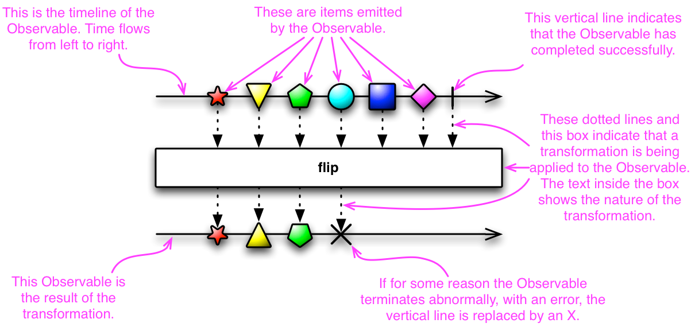
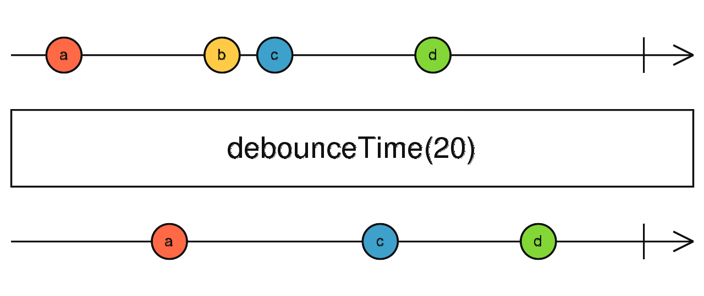
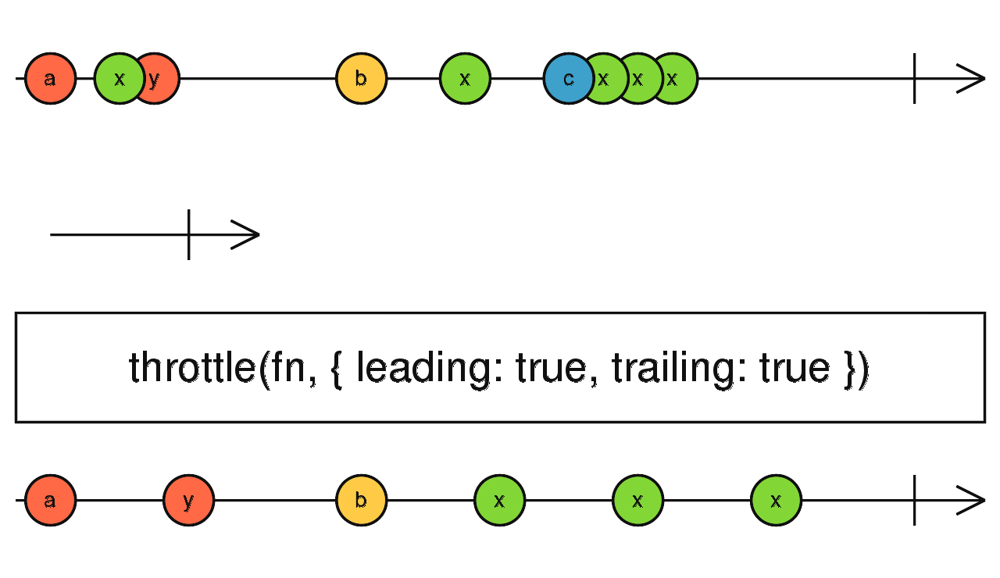

자바스크립트는 객체지향 프로그래밍, 명령형 프로그래밍, 함수형 프로그래밍 등의 패러다임을 지원하는 멀티 패러다임 언어입니다. 이번 포스트에서는 이와같은 프로그래밍 패러다임 중, `반응형 프로그래밍(Reactive Programming)`에 대해 알아본 결과를 공유합니다.

## 반응형 프로그래밍

위키피디아에서는 반응형 프로그래밍을 아래와 같이 정의합니다.

> 데이터 스트림과 변경의 전파에 관한 선언적 프로그래밍 패러다임

이 정의는 너무 일반적이고 이론적이라 잘 와닿지 않습니다. [레퍼런스](https://gist.github.com/staltz/868e7e9bc2a7b8c1f754)에서 정의한 바에 따르면 반응형 프로그래밍은

> 비동기적 데이터 스트림을 이용한 프로그래밍

이라 합니다. 여기서 스트림은 우리말로 `흐름`을 의미합니다. 데이터 스트림이란 다시말해 데이터의 흐름을 의미하는 것입니다. 반응형 프로그래밍에서는 _모든 것을 데이터의 흐름으로 만들 수 있다_ 는 아이디어로부터 시작합니다. 어떤 데이터가 시스템 내부로 들어와 가공되어 시스템 밖으로 출력되기까지, 사용자가 UI 구성요소와 상호작용해 애플리케이션의 상태가 변화되기까지의 과정 등 무엇이든 데이터 스트림이 될 수 있습니다.

사실 _비동기적 데이터 스트림_ 이라는 말은 크게 새로울 것이 없습니다. 우리는 자바스크립트 개발자이니, 브라우저에서 사용자가 버튼을 클릭하는 상황을 생각해보겠습니다. 버튼의 입장에서, 자신이 언제 클릭될지는 알 수 없습니다. 이벤트의 주체는 사용자이기 때문에, 버튼의 클릭 이벤트는 비동기적으로 발생한다고 볼 수 있습니다. 또한 버튼은 계속 클릭될 수 있어야 하므로 시간에 따른 클릭이벤트를 _비동기적 데이터 스트림_ 으로 볼 수 있습니다.

```text
시간에 따른 데이터 스트림
-A----B----C-----X-----|-->

A: 데이터 발생 1
B: 데이터 발생 2
C: 데이터 발생 3
X: 에러 발생
|: 스트림의 끝
```

위 코드블록은 시간에 따른 데이터 스트림을 나타내는 그림입니다. `A`, `B`, `C`는 비동기적으로 데이터가 발생하는 것을 의미하고, `X` 와 `|` 는 각각 에러 발생과 스트림의 종료를 의미합니다. 이러한 데이터 스트림은 **관찰**될 수 있는 하나의 **주제**가 되는데, 각 `데이터의 발생`, `에러 발생`, `스트림의 종료` 이벤트마다 등록된 **옵저버 함수**가 실행됩니다. 따라서 **반응형 프로그래밍 패러다임은 옵저버 패턴에 기반한다** 라고 할 수 있습니다.

## ReactiveX

이번 포스트의 메인 주제이기도 한 ReactiveX는 이러한 반응형 프로그래밍을 지원하기 위한 라이브러리입니다. 자바스크립트에서는 `RxJS` 라이브러리를 사용해 반응형 프로그래밍 패러다임으로 코드를 작성할 수 있습니다. Rx 라이브러리의 구현체들의 흐름은 동일하지만, RxJS 는 크게 세가지 개념으로 이루어집니다. `Observable`, `Operator`, `Subject` 가 그것입니다.

### Observable

RxJS 에서는 반응형 프로그래밍의 데이터 스트림을 `Observable`이라는 객체로 표현합니다. 이 Observable 은 아래 사진과 같이 시각적으로 표현할 수 있는데, 이를 `마블 다이어그램`이라 합니다. 위에서 간단히 표현한 그림과 동일합니다.



### Operator

RxJS의 또다른 구성요소는 `Operator`입니다. Operator는 Observable 상에서 동작하고 Observable을 리턴합니다. Operator들은 Observable을 생성, 변환, 필터링, 결합 등의 작업을 할 수 있도록 합니다. 어떠한 연산자가 어떠한 작업을 위해 쓰일 수 있는지는 [레퍼런스](http://reactivex.io/documentation/ko/operators.html)에서 확인할 수 있습니다.

### Subject

`Subject`는 하나 이상의 다른 Observable을 구독할 수 있으며 동시에 Observable 이기도 한 일종의 교각 또는 프록시 역할을 하는 객체입니다. Subject 는 어떠한 Observable을 구독하며 Observable이 데이터를 배출시키도록 동작합니다. 따라서 Cold Observable(옵저버가 구독하기 전까진 데이터를 배출하지 않는 Observable)을 Hot Observable(옵저버의 유무에 상관없이 데이터를 배출하는 Observable)으로 만들기도 합니다.

Subject의 종류와 동작에 관한 자세한 설명은 [레퍼런스](http://reactivex.io/documentation/ko/subject.html)에서 확인할 수 있습니다.

## RxJS 적용하기

### 기본 사용법

RxJS 는 **Observable**과 Observable을 조작하는 **Operator**, 그를 subscribe 하는 **Observer** 함수들의 조합을 생각하면 됩니다. Observable은 직접 Observable 클래스의 생성자를 호출해 생성할 수도 있고, RxJS 가 제공하는 여러 api를 이용해 생성할 수도 있습니다.

``` javascript
const random4 = new Rx.Observable((subscriber) => { // subscriber는 이 Observable을 구독할 옵저버 함수에 해당하는 객체
  subscriber.next(Math.floor(Math.random * 10)); // next 는 데이터 스트림에 들어가는 데이터
  subscriber.next(Math.floor(Math.random * 10));
  subscriber.next(Math.floor(Math.random * 10));
  subscriber.next(Math.floor(Math.random * 10));
  subscriber.complete(); // complete가 호출되면 데이터 스트림의 끝임을 알림
})
const oneToTen = Rx.range(1, 10); // range 함수를 사용해 1에서 10까지의 정수 스트림 생성
const clickStream = Rx.fromEvent(document, "click"); // document를 클릭할 시 데이터를 발생시키는 이벤트 스트림
```

위 코드와 같이 다양한 방법으로 Observable을 생성할 수 있습니다. 이렇게 생성된 Observable은 옵저버 함수가 subscribe 하기 전까지 Operator로 수정해줄 수 있습니다.

``` javascript
const doubledRandom4 = random4.pipe(
  map((x) => x + 1),
  map((x) => x * 2),
) // pipe 함수로 여러 operator를 조합
const mergedRange = oneToTen.merge(random4) // merge 함수로 다른 Observable과 조합할 수도 있음
```

pipe, merge 등의 함수를 이용해 Observable을 조작할 수 있습니다. 이러한 함수들의 목록과 역할은 [레퍼런스](https://rxjs-dev.firebaseapp.com/api)에서 확인할 수 있습니다. 이제 필요한 만큼 Observable을 조작하기도 했으니 subscribe하여 스트림 내부의 데이터를 꺼내 사용하겠습니다.

``` javascript
random4.subscribe((x) => { console.log(x) }); // 난수 4개 출력
doubledRandom4.subscribe((x) => { console.log(x) }); // (난수 4개 + 1 * 2) 출력, 기존 난수 범위 10보다 큰 값이 출력되기도 함
oneToTen.subscribe({ // subscribe 함수에 객체를 전달하면 스트림 에러 및 완료시 동작을 정의가능
  next(x) { // 데이터 발생시 실행
    console.log("data", x);
  },
  error() { // 에러 발생시 실행
    console.error("error on stream");
  },
  complete() { // 스트림 완료시 실행
    console.log("stream finished");
  },
});
```

_반응형으로 생각하기_ 에 익숙하지 않다면 이러한 사용법이 잘 와닿지 않을 수 있습니다. 객체지향 패러다임으로만 코드를 쓰다 함수형 프로그래밍 패러다임으로 코드를 쓰려면 어려운 것과 비슷한 느낌입니다. RxJS 에서 제공하는 `debouncing`과 `throttling` Operator를 사용해 더블클릭을 감지하는 예제를 보겠습니다.

### debouncing을 이용한 더블클릭 감지

<center>
<iframe height="300" style="width: 100%; max-width: 500px;" scrolling="no" title="RxJS double click" src="https://codepen.io/rudypark3091/embed/ExvwZpv?default-tab=result" frameborder="no" loading="lazy" allowtransparency="true" allowfullscreen="true">
  See the Pen <a href="https://codepen.io/rudypark3091/pen/ExvwZpv">
  RxJS double click</a> by RudyPark3091 (<a href="https://codepen.io/rudypark3091">@rudypark3091</a>)
  on <a href="https://codepen.io">CodePen</a>.
</iframe>
</center>



``` javascript
const closed = document.getElementById("closed");
const opened = document.getElementById("opened");

const ops = rxjs.operators;
const clickStream = rxjs.fromEvent(window.app, "click");

const debouncedStream = clickStream.pipe(ops.debounceTime(250));
const doubleClickStream = clickStream.pipe(
  ops.buffer(debouncedStream),
  ops.map((buf) => buf.length),
  ops.filter((len) => len >= 2)
);

doubleClickStream.subscribe(() => {
  opened.classList.toggle("hidden");
  closed.classList.toggle("hidden");
});
```

RxJS 에서 제공하는 `debounceTime` operator를 이용해 더블클릭 이벤트를 감지합니다. debounceTime operator는 이름에서 의미하는 바와 같이 지정한 시간 동안 발생한 가장 최근에 발생한 데이터만 통과시킵니다. 이후 buffer, map, filter operator를 사용해 해당 클릭 이벤트가 더블클릭 이벤트인지 판별합니다. 이 과정을 마블 다이어그램으로 표현해보면 아래와 같습니다.

```
                          250 ms
                          |-|
clickStream:       ---c---c-c--------c---c---cc------|->  = 최초 클릭 이벤트 스트림
debouncedStream:   -----d-----d--------d---d----d----|->
                   vvvvvvvvvvvvv   pipe   vvvvvvvvvvvvvv
buffer:            -----c-----c--------c--------c----|->
                              c                 c    | >

map:               -----1-----2--------1--------2----|->
filter:            -----------f-----------------f----|->
                   vvvvvvvvvvvvv  result  vvvvvvvvvvvvvv
doubleClickStream: -----------e-----------------e----|->
= 최종 더블클릭 이벤트 스트림
```

`buffer` operator는 debouncedStream의 이벤트 사이에 clickStream 이벤트를 버퍼링해주는 역할을 하고, `map`, `filter` operator는 Array.prototype 의 map, filter 메소드와 동일한 역할을 합니다. 이러한 operator 들의 조합으로 클릭 이벤트간의 간격이 250 ms 이하인 클릭 이벤트를 감지할 수 있습니다. 그 결과로 우리는 더블클릭 이벤트 스트림을 얻을 수 있고, 이 스트림을 subscribe 하여 이벤트 리스너를 등록할 수 있습니다.

### throttling으로 개선하기

위에서 작성한 더블클릭 예제는 어딘가 부족한 점이 있습니다. debounceTime을 이용했기 때문에 이벤트 간격을 250 밀리초가 아니라 더 큰 값을 주게 되면 더블클릭 이벤트가 발생하고 난 뒤 이벤트 간격에 해당하는 시간동안 딜레이가 생깁니다. 아래 예제처럼 말이죠.

<center>
<iframe height="300" style="width: 100%; max-width: 500px;" scrolling="no" title="debounced stream delay 1000ms" src="https://codepen.io/rudypark3091/embed/ExvbYpx?default-tab=result" frameborder="no" loading="lazy" allowtransparency="true" allowfullscreen="true">
  See the Pen <a href="https://codepen.io/rudypark3091/pen/ExvbYpx">
  debounced stream delay 1000ms</a> by RudyPark3091 (<a href="https://codepen.io/rudypark3091">@rudypark3091</a>)
  on <a href="https://codepen.io">CodePen</a>.
</iframe>
</center>

``` javascript
const closed1 = document.getElementById("closed");
const opened1 = document.getElementById("opened");
const closed2 = document.getElementById("closed2");
const opened2 = document.getElementById("opened2");

const ops = rxjs.operators;
const apps = document.querySelectorAll(".app");
const clickStream1000 = rxjs.fromEvent(apps[0], "click");
const clickStream2000 = rxjs.fromEvent(apps[1], "click");

const debouncedStream1000 = clickStream1000.pipe(ops.debounceTime(1000));
const debouncedStream2000 = clickStream2000.pipe(ops.debounceTime(2000));

const bufferStream1000 = clickStream1000.pipe(
  ops.buffer(debouncedStream1000),
  ops.map((buf) => buf.length),
  ops.filter((len) => len >= 2)
);
const bufferStream2000 = clickStream2000.pipe(
  ops.buffer(debouncedStream2000),
  ops.map((buf) => buf.length),
  ops.filter((len) => len >= 2)
);

bufferStream1000.subscribe(() => {
  opened1.classList.toggle("hidden");
  closed1.classList.toggle("hidden");
});
bufferStream2000.subscribe(() => {
  opened2.classList.toggle("hidden");
  closed2.classList.toggle("hidden");
});
```

이 문제를 해결하기 위해 `throttle` Operator를 사용해보겠습니다. throttle operator는 아래 마블 다이어그램에 표시된 것과 같이 어떠한 스트림의 데이터들을 일정 시간동안 무시하고, 다시 배출하는 것을 반복합니다. 이때 leading과 trailing 옵션으로 최초 또는 마지막에 발생하는 데이터를 받아들일지 무시할지 결정합니다.



<center>
<iframe height="300" style="width: 100%; max-width: 500px;" scrolling="no" title="throttle" src="https://codepen.io/rudypark3091/embed/vYJWYLW?default-tab=result" frameborder="no" loading="lazy" allowtransparency="true" allowfullscreen="true">
  See the Pen <a href="https://codepen.io/rudypark3091/pen/vYJWYLW">
  throttle</a> by RudyPark3091 (<a href="https://codepen.io/rudypark3091">@rudypark3091</a>)
  on <a href="https://codepen.io">CodePen</a>.
</iframe>
</center>

``` javascript
const closed = document.getElementById("closed");
const opened = document.getElementById("opened");

const ops = rxjs.operators;
const clickStream = rxjs.fromEvent(window.app, "click");

const throttledStream = clickStream.pipe(
  ops.throttle(() => rxjs.interval(250), {
    leading: false,
    trailing: true
  })
);
const bufferStream = clickStream.pipe(
  ops.buffer(throttledStream),
  ops.map((buf) => buf.length),
  ops.filter((len) => len >= 2)
);

bufferStream.subscribe(() => {
  opened.classList.toggle("hidden");
  closed.classList.toggle("hidden");
});
```

위 과정을 debounce 예제와 같은 마블 다이어그램으로 표현하면 아래와 같습니다.

```
                   250 ms
                   |-|
clickStream:       ---c---c-c--------c---c---cc------|->  = 최초 클릭 이벤트 스트림
interval:          --|->
throttledStream:   -----d---d----------d---d---d-----|->
                   vvvvvvvvvvvvv   pipe   vvvvvvvvvvvvvv
buffer:            -----c---c----------c-------c-----|->
                            c                  c     | >

map:               -----1---2----------1-------2-----|->
filter:            ---------f------------------f-----|->
                   vvvvvvvvvvvvv  result  vvvvvvvvvvvvvv
doubleClickStream: ---------e------------------e-----|->
= 최종 더블클릭 이벤트 스트림
```

위의 debounce 스트림과 다른 점이 있다면, throttle Operator는 첫 데이터가 발생하고 250ms 의 인터벌이 끝나면 바로 throttledStream 의 데이터가 생성됩니다. 따라서 최초 클릭 이후 인터벌만큼의 시간이 흐르기 전에 한번 더 클릭을 하게되면 더블클릭 이벤트로 인식되게 됩니다.

```
                      1000 ms
                   |----------|      |----------|
clickStream:       ---c---c-c--------c---c---cc------|->  = 최초 클릭 이벤트 스트림
interval:          -----------|->
throttledStream:   -----------d-----------------d----|->
                   vvvvvvvvvvvvv   pipe   vvvvvvvvvvvvvv
buffer:            ----------c4----------------c4----|->

map:               -----------4-----------------4----|->
filter:            -----------f-----------------f----|->
                   vvvvvvvvvvvvv  result  vvvvvvvvvvvvvv
doubleClickStream: -----------e-----------------e----|->
= 최종 더블클릭 이벤트 스트림
```

위와 같이 인터벌을 1000ms 과 2000ms 로 처리한 예제는 아래와 같습니다.

<center>
<iframe height="300" style="width: 100%; max-width: 500px;" scrolling="no" title="throttled interval 1000ms" src="https://codepen.io/rudypark3091/embed/rNzYavd?default-tab=result" frameborder="no" loading="lazy" allowtransparency="true" allowfullscreen="true">
  See the Pen <a href="https://codepen.io/rudypark3091/pen/rNzYavd">
  throttled interval 1000ms</a> by RudyPark3091 (<a href="https://codepen.io/rudypark3091">@rudypark3091</a>)
  on <a href="https://codepen.io">CodePen</a>.
</iframe>
</center>

``` javascript
const closed1 = document.getElementById("closed");
const opened1 = document.getElementById("opened");
const closed2 = document.getElementById("closed2");
const opened2 = document.getElementById("opened2");

const ops = rxjs.operators;
const apps = document.querySelectorAll(".app");
const clickStream1000 = rxjs.fromEvent(apps[0], "click");
const clickStream2000 = rxjs.fromEvent(apps[1], "click");

const throttledStream1000 = clickStream1000.pipe(
  ops.throttle(() => rxjs.interval(1000), {
    leading: false,
    trailing: true
  })
);
const throttledStream2000 = clickStream2000.pipe(
  ops.throttle(() => rxjs.interval(2000), {
    leading: false,
    trailing: true
  })
);

const bufferStream1000 = clickStream1000.pipe(
  ops.buffer(throttledStream1000),
  ops.map((buf) => buf.length),
  ops.filter((len) => len >= 2)
);
const bufferStream2000 = clickStream2000.pipe(
  ops.buffer(throttledStream2000),
  ops.map((buf) => buf.length),
  ops.filter((len) => len >= 2)
);

bufferStream1000.subscribe(() => {
  opened1.classList.toggle("hidden");
  closed1.classList.toggle("hidden");
});
bufferStream2000.subscribe(() => {
  opened2.classList.toggle("hidden");
  closed2.classList.toggle("hidden");
});
```

위의 debounced 예제와 비교했을 때 인터벌이 길어지게 되면 조금 답답한 면은 있지만, throttle 예제는 인터벌 동안의 더블클릭을 감지하는 반면 debounce 예제는 마지막 클릭 이후의 인터벌 동안 더이상 클릭이벤트가 발생하지 않을 때까지 기다린다는 점에서 throttle Operator를 이용한 편이 더 사용성이 좋아 보입니다.

## 마치며

RxJS 라이브러리를 이용하여 반응형 프로그래밍 패러다임으로 간단한 예제를 하나 작성해봤습니다. 이 포스트에서는 간단한 더블클릭 예제만 알아봤지만, 반응형 프로그래밍 역시 프로그래밍 패러다임의 일종이기 때문에 많은 일들을 할 수 있습니다. 여기서 다루지 않은 RxJS의 Operator들이 아주 많습니다. 이러한 Operator들을 잘 이용하면 **모든 것을 스트림으로 처리하는** 반응형 프로그래밍 코드를 쓸 수 있을거라 생각됩니다. 추가적인 예제는 [레퍼런스](https://gist.github.com/staltz/868e7e9bc2a7b8c1f754)에서 확인할 수 있습니다.

## 레퍼런스

The introduction to Reactive Programming you've been missing: [https://gist.github.com/staltz/868e7e9bc2a7b8c1f754](https://gist.github.com/staltz/868e7e9bc2a7b8c1f754)  
wikipedia - Reactive Programming: [https://en.wikipedia.org/wiki/Reactive\_programming](https://en.wikipedia.org/wiki/Reactive_programming)  
reactivex - observable: [http://reactivex.io/documentation/ko/observable.html](http://reactivex.io/documentation/ko/observable.html)  
reactivex - operator: [http://reactivex.io/documentation/ko/operators.html](http://reactivex.io/documentation/ko/operators.html)  
reactivex - subject: [http://reactivex.io/documentation/ko/subject.html](http://reactivex.io/documentation/ko/subject.html)  
RxJS - api reference: [https://rxjs-dev.firebaseapp.com/api](https://rxjs-dev.firebaseapp.com/api)  
