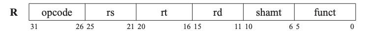
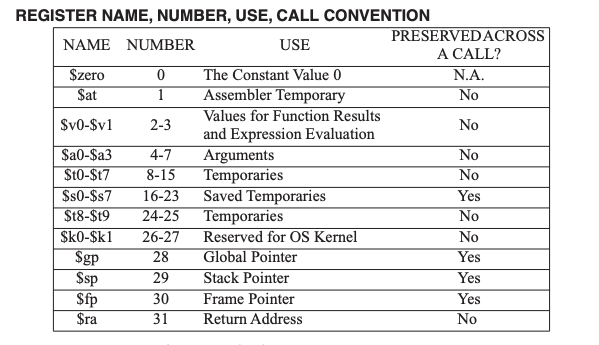
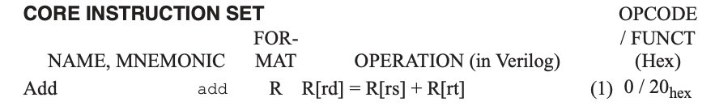
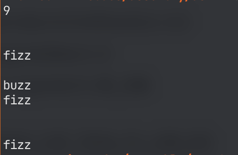

## 개요

이번 포스트의 주제는 ‘컴퓨터는 어떻게 코드를 실행할까?’ 입니다

왜 뜬금없이 이런 주제를 공부했냐? 라고 물으신다면,

유튜브를 돌아다니다 우연히 발견한 한 영상 때문입니다

<center>
<iframe width="560" height="315" src="https://www.youtube.com/embed/YBYI7E2PqWE?start=330" title="YouTube video player" frameborder="0" allow="accelerometer; autoplay; clipboard-write; encrypted-media; gyroscope; picture-in-picture" allowfullscreen></iframe>
</center>

오징어 게임을 패러디한 이 영상은 프로그래머들이 어셈블리어로 Fizzbuzz 프로그램을 작성하는 상황이 연출됩니다

그 중 한 장면이 제 마음을 불편하게 했습니다

> A: 나 어셈블리어 할줄몰라  
B: 컴퓨터구조 시간에 배웠던걸 기억해내봐  
A: 몰라 난 부트캠프 출신이라고  

안타깝게도 저는 부트캠프 출신이고, 컴퓨터구조 강의도 수강했지만 어셈블리어를 할 줄 몰랐습니다

이에 양심이 크게 아려와 어셈블리어를, 나아가 컴퓨터가 우리 코드를 실행하는 과정을 공부해봤습니다

## 어셈블리어와 기계어

컴퓨터는 데이터를 비트 단위의 이진수로 처리합니다

이 이진수를 통틀어 **기계어**라 부릅니다

기계어는 CPU가 직접 해독하고 실행할 수 있으므로 CPU의 종류에 따라서 다른 형태를 가집니다

기계어와 같이 컴퓨터가 이해할 수 있는 언어는 **저급 언어**라 불리며, 우리가 작성한 코드가 실행되기 위해선 이러한 저급 언어로 변환하는 과정이 필요합니다

**어셈블리어**는 대표적인 저급 언어입니다

어셈블리어는 기계어와 1대1로 대응되는 언어로, 기계어와 마찬가지로 CPU의 종류에 따라 코드가 달라집니다

### 명령어

어셈블리어에서 기계어로의 번역은 `어셈블` 이라 부르고, `어셈블러` 라는 프로그램을 이용합니다

제가 컴퓨터구조 강의시간에 배운 MIPS 아키텍처를 예시로 어셈블리어가 어떻게 기계어로 변환되는지 알아보겠습니다

MIPS 아키텍처는 밉스 테크놀로지에서 개발한 RISC ISA로, `R`, `I`, `J` 의 명령어 포맷이 있습니다

### MIPS ISA R format



[MIPS Green Sheet](https://inst.eecs.berkeley.edu/~cs61c/resources/MIPS_Green_Sheet.pdf) 에서 가져온 R format 구조입니다

각 파트가 의미하는 바는 아래와 같습니다

- opcode: 명령어가 수행할 연산의 종류
- rs: 첫번째 피연산 레지스터
- rt: 두번째 피연산 레지스터
- rd: 목적 피연산 레지스터
- shamt: shift amount
- funct: function, 연산의 구체적인 종류

또한 레지스터별 번호 할당은 아래 표와 같습니다



`add $t0, $s1, $s2` 의 명령어를 기계어로 변환해보겠습니다



add 는 rd = rt + rs 를 나타내는 명령어고 `opcode = 0`, `funct = 0x20` 이므로

opcode: 0
rs: 17
rt: 18
rd: 8
shamt: 0
funct: 32 (0x20 = 32) 입니다

따라서 이를 비트수에 맞게 이진수로 변환하면

```jsx
opcode rs    rt    rd    shamt funct
000000 10001 10010 01000 00000 100000
```

가 되므로,

결국 `add $t0, $s1, $s2` 명령어는 `00000010001100100100000000100000` 로 표현됩니다

### x86_64

제 인텔 맥북의 명령어 아키텍처는 64비트 x86 명령어셋 으로, `x86_64` 라 불립니다

이 명령어셋은 최초로 `AMD`에 의해 `AMD64`라는 이름으로 고안되었습니다

우리가 사용하는 macos의 명령어셋은 `Intel 64`라는 이름으로 인텔이 AMD로부터 라이선스를 받아 만들어낸 명령어 셋입니다

흔히 i3, i5 등으로 표현하는 인텔 코어 i3, 인텔 코어 i5 등등의 CPU가 이 아키텍처를 사용합니다

## 컴파일

어셈블리어로 프로그램을 작성해보기 전, c언어로 쓴 코드가 기계어로 만들어지기까지의 과정을 알아보겠습니다

- 전처리
    - c언어 컴파일러의 전처리기는 `#define`, `#include` 같은 구문들에 대해 대치작업을 실시합니다
    - 단순 텍스트 대치 작업이 이 단계에서 이뤄집니다
- 컴파일
    - 전처리가 끝나고 우리가 작성한 고급 코드를 저급 코드로 바꿔주는 작업인 컴파일 과정이 진행됩니다
    - 이 과정에서 만들어지는 부산물은 `.s` 의 확장자를 가지는 어셈블리어 파일입니다
- 어셈블
    - 어셈블리어를 기계어로 변환시키는 과정입니다
    - 아까 언급했듯 이 과정에서 플랫폼 종속적인 기계어 코드를 만들어냅니다
    - 이 과정에서 만들어지는 부산물은 `.o` 의 확장자를 가지는 오브젝트 파일입니다
    - 이 오브젝트 파일은 컴퓨터가 이해할 수 있는 바이너리 포맷입니다 (0과 1로 이루어짐)
- 링크
    - 최종적으로 오브젝트 파일들을 하나로 이어주는 작업입니다
    - 하나의 실행 파일로 만들어 executable을 만들어냅니다

어셈블리어로 코드를 쓴다면 위 과정에서 전처리와 컴파일 과정을 건너뛰게 됩니다

어셈블 작업을 위한 다양한 어셈블러가 있지만, 저는 `nasm` 이라는 프로그램을 사용했습니다

`nasm` 은 netwide assembler로 intel x86 아키텍처에서 많이 사용되는 어셈블러입니다

또한 링크 작업을 위해 `ld` 를 사용했습니다

`ld` 는 GNU 컴파일러 모음(gcc)의 일부로, 목적파일들로부터 실행 파일을 생성하는 링커를 실행해줍니다

## Hello world

어셈블리어로 hello world 프로그램을 작성해보겠습니다

```bash
global _main

	section .text

_main:
	mov     rax, 0x2000004
	mov     rdi, 1
	mov     rsi, msg
	mov     rdx, 14
	syscall

	mov     rax, 0x2000001
	mov     rdi, 0
	syscall

	section .data

msg:    db      "Hello, world!", 10
```

위 어셈블리 코드를 hello.asm 에 저장합니다

c언어의 컴파일 과정에서 `컴파일` 단계까지 마무리된 것과 같은 상황이므로, nasm 을 이용해 object 파일로 만들어줍니다

```bash
$ nasm -f macho64 hello.asm
```

저는 64비트 macos 를 사용하므로, 출력 object 파일 포맷을 macho64 로 지정합니다

이 명령어를 수행하면 hello.o 라는 object 파일이 생성됩니다

이를 실행가능하도록 만들기 위해선 링크과정을 거쳐야합니다

```bash
$ ld -L /Library/Developer/CommandLineTools/SDKs/MacOSX.sdk/usr/lib -lSystem hello.o -o a.out
```

GNU `ld` 를 이용해 하나의 바이너리로 만들어주는 명령어입니다

이 과정에서 macos 플랫폼에 맞도록 시스템 라이브러리를 링크해 `a.out` 이라는 이름으로 결과물을 만들어냅니다

이 명령어를 계속 반복해서 치는것은 정말 귀찮으므로, 간단하게 쉘 스크립트로 자동화해보겠습니다

```bash
nasm -f macho64 "$@.asm" \
&& ld -L /Library/Developer/CommandLineTools/SDKs/MacOSX.sdk/usr/lib \
-lSystem "$@.o" -o a.out
```

위 코드를 `build.sh` 파일에 붙여넣은 뒤, 쉘에 `./build.sh hello`을 입력하면 `hello.asm` 파일의 내용물을 이용해 `a.out` 이라는 이름의 바이너리가 만들어집니다

이제 영역별로 코드와 어떤 역할을 하는지 살펴보겠습니다

### global

다른 모듈에서 심볼에 접근할 수 있도록 하기 위해 사용됩니다

어셈블리어에서는 기본적으로 모든 코드가 private 이므로 링크과정에서 올바른 심볼을 찾을수 있도록 하기 위한 부분입니다

아쉽지만 이번 예제에서는 모든 코드를 하나의 파일로 작성하였기 때문에 활용하지 못했습니다

### section

[레퍼런스](https://www.tutorialspoint.com/assembly_programming/assembly_basic_syntax.htm)에 따르면 section에는 `data`, `bss`, `text` section이 있습니다

그 중 `text` 영역은 실행가능한 코드가 들어가는 영역입니다

레퍼런스에서는 `global _start` 라는 코드로 시작해야 한다고 설명하고 있지만, 예제 코드가 이상없이 작동되는 것을 보아 플랫폼별로 스펙이 다른 것으로 생각됩니다

`data` 영역은 initialized data or constants, 즉 상수 또는 리터럴이 들어가는 영역입니다

data 영역에 들어간 값은 런타임에 변경되지 않는 값들입니다

상수값, 파일이름, 버퍼 사이즈 등이 이 영역에 들어갈 수 있습니다

`bss` 영역은 변수를 선언하는 영역입니다

위 hello world 예제에서는 나오지 않았지만, 두번째 예제에서 살펴보도록 하겠습니다

### system call

mov 명령어를 이용해 특정 규칙대로 레지스터에 값을 할당하고 `syscall` 명령어를 통해 `system call` 을 호출하고 있습니다

system call은 커널이 제공하는 서비스를 응용 프로그램이 호출할 수 있는 인터페이스입니다

커널은 부팅과정에서 전체 메모리의 일부를 점유하고 동작하지만 응용 프로그램은 커널이 제공하는 자원을 사용하므로 메모리에서 상황에 따라 다른 위치를 점유하고 동작하게 됩니다

따라서 응용 프로그램은 정확한 물리 주소를 확정할 수 없고, 유저 스페이스에서 동작하므로 특정한 기계어 실행이 불가능합니다 (물리주소 → 논리주소의 변환은 MMU 라는 하드웨어 부품이 담당합니다)

이에 응용 프로그램이 파일 시스템에 접근하는 등의 동작을 하기 위해선 커널에 의존해야만 합니다

이러한 상황에서 응용 프로그램이 커널 서비스를 호출하기 위한 방법을 system call 이라고 합니다

### write system call

```bash
mov     rax, 0x2000004
mov     rdi, 1            ; STDOUT
mov     rsi, msg
mov     rdx, 14
syscall
```

위 코드는 표준출력을 통해 터미널에 문자를 출력하기 위한 system call 입니다

```bash
4	AUE_NULL	ALL	{ user_ssize_t write(int fd, user_addr_t cbuf, user_size_t nbyte); }
```

위 코드는 macos의 기반이 되는 운영체제 darwin의 커널 `xnu` 에서 사용가능한 시스템 콜의 시그니처입니다

[레퍼런스](http://6.s081.scripts.mit.edu/sp18/x86-64-architecture-guide.html)에 따르면 **전달하는 인자는 순서대로 `rdi`, `rsi`, `rdx`, `rcx`, `r8`, `r9` 레지스터에 할당**하면 된다고 합니다

또한 syscall 과정마다 값의 보존이 보장되지 않습니다

write system call 에 할당된 코드는 4이고, system call 의 종류는 `rax`레지스터를 참조합니다

또한 커널에게 표준출력을 사용한다는것을 명시하기 위해 첫번째 인자인 `rdi` 레지스터에 1을 할당합니다

POSIX 표준에서 1이라는 상수는 표준 출력 스트림의 file descriptor 로 정의되어 있기 때문입니다

출력할 문자열의 주소를 커널에게 알려주기 위해 `rsi` 레지스터에 값을 할당합니다

마지막으로 출력할 문자열의 길이를 커널에게 알려주기 위해 `rdx` 레지스터에 값을 할당합니다

따라서 터미널에 `msg` 라 정의된 문자열을 출력하기 위해 위와 같은 코드를 사용하게 됩니다

### exit system call

```bash
mov     rax, 0x2000001
mov     rdi, 0
syscall
```

위 코드는 프로그램을 종료시키기 위한 system call입니다

출력 system call 과 비슷하게 `rax` 와 `rdi` 레지스터에 값을 할당해주고 있습니다

```clojure
1	AUE_EXIT	ALL	{ void exit(int rval) NO_SYSCALL_STUB; }
```

exit system call 에 할당된 코드는 1이므로 `rax` 레지스터에 `0x2000001`을 할당합니다

exit code 에 0을 주기 위해 `rdi`레지스터에 0을 할당하고 system call을 호출합니다

xnu 커널에서 사용가능한 모든 시스템 콜은 [레퍼런스](https://github.com/opensource-apple/xnu/blob/master/bsd/kern/syscalls.master)에서 확인할 수 있습니다

### macro

nasm은 전처리기가 존재하기 때문에 macro 기능이 존재합니다

이를 이용해 예제 코드를 좀 더 고급 언어에 가깝게 표현하면 아래와 같습니다

```bash
%macro write_stdout 2
	mov rax, 0x02000004
	mov rdi, 1
	mov rsi, %1
	mov rdx, %2
	syscall
%endmacro

%macro exit 1
	mov rax, 0x02000001
	xor rdi, %1
	syscall
%endmacro

global _main
	section .text

_main:
	write_stdout msg, 14
	exit 0

	section .data
msg: db "Hello, world!", 10
```

`write_stdout` 이라는 매크로를 정의해 함수처럼 출력문을 사용하고 있습니다

**하지만 사실은 어셈블리어에도 함수를 사용할 수 있습니다**

## 함수 사용하기

함수는 text section의 첫부분에 `_main` 영역을 선언한 것과 같이 선언할 수 있습니다

이렇게 레이블을 만들어두고, `call` 명령어를 이용하면 함수를 호출할 수 있습니다

```bash
global _main
	section .text

_main:
	call hello
	mov rax, 0x02000001
	mov rdi, 0
	syscall

hello:
	mov rax, 0x02000004
	mov rdi, 1
	mov rsi, message
	mov rdx, 14
	syscall
	ret

	section .data
message: db "Hello world!", 10
```

위 hello world 예제와 정확히 똑같은 일을 하는 어셈블리 코드입니다

계속 hello world 만 찍는 것은 지루하니, 이번 포스트를 쓰게 된 계기이기도 한 `Fizzbuzz`코드를 짜보겠습니다

## Fizzbuzz

### loop 만들기

`ecx` 레지스터와 `jump` 명령어를 이용해 반복문을 구성할 수 있습니다

아래 코드는 ecx 레지스터에 초기값을 할당하고 특정 숫자가 될때까지 해당 작업을 반복하는 방식입니다

```bash
_main:
	mov ecx, 0

	call loopstart

	mov rax, 0x02000001
	mov rdi, 0
	syscall

loopstart:
	push rcx

	mov rax, 0x02000004
	mov rdi, 1
	mov rsi, hello_world
	mov rdx, hello_world_len
	syscall

	pop rcx

	inc ecx
	cmp ecx, 10
	jnz loopstart
	ret
```

Hello world 를 10 회 출력하는 반복문입니다

system call 과정에서 `rcx` 레지스터의 값이 보존되지 않는다고 했습니다

현재 루프의 반복조건에 rcx 레지스터의 일부인 `ecx` 레지스터의 값을 사용하고 있으므로, `rcx` 레지스터에 system call 전후로 push pop을 해줘서 이전 값을 사용할 수 있도록 합니다

`jnz` 명령어는 `ZF` 라는 플래그 레지스터의 값이 0이면 해당 주소로 이동하고 그렇지 않으면 이동하지 않는 명령어입니다

플래그 레지스터에 관한 정보는 [레퍼런스](http://judis.me/wordpress/x86-flags-register/)에서 확인할 수 있습니다

### 나눗셈 연산하기

```bash
div_three:
	mov eax, 7
	xor edx, edx

	mov ebx, 3
	div ebx
	add eax, '0'
	mov [result], eax

	mov rax, 0x02000004
	mov rdi, 1
	lea rsi, [result]
	mov rdx, 1
	syscall
	ret

	section .bss
default rel
result: resb 4
```

7으로 3을 나누는 연산에 피연산자 7을 하드코딩했습니다

여기서 `section` 단락에서 언급했던 `.bss section` 이 나옵니다

bss section은 변수를 선언하는 영역이라 했습니다

위 코드의 2번째 블록의 마지막줄에서 eax 레지스터의 값을 `result` 변수에 할당하고 있습니다

이때 result 라는 변수는 `default rel` 키워드를 이용해 선언했습니다

`default rel`은 라벨링된 메모리 주소를 참조할때 기본적으로 `rel` 명령어를 사용하겠다 라는 의미입니다

macos 에서는 기본적으로 절대주소 참조를 허용하지 않기 때문에 이렇게 사용해야 한다고 합니다

result 변수를 선언할때 이를 붙이지 않으면 코드에서 result 로 접근하기 위해 `mov [rel result], eax` 와 같이 써주면 됩니다

또 3번째 문단의 3번째줄에서 `mov` 명령어 대신 `lea` 명령어를 사용합니다

`lea` 명령어는 `Load Effective Address`로, mov 명령어와는 다르게 값이 아닌 주소값을 참조하게 됩니다

C언어에서 일반 변수와 포인터 변수와의 관계를 생각하면 쉬울 것 같습니다

연산 이후 나눗셈 결과는 `edx` 레지스터와 `eax` 레지스터에 담기게 됩니다

**`edx` 레지스터에는 나머지값이, `eax` 레지스터에는 나눗셈의 몫**이 할당되므로, 필요한 값을 선택해 가져올 수 있습니다

따라서 위 코드를 실행했을 때에는 eax 에 나눗셈의 몫 2가 저장됩니다

이를 출력하기 위해 `add` 명령어로 숫자 타입을 문자 타입으로 바꿔 result 에 할당해줬습니다

### 값에 따라 분기하기

```bash
global _main
	section .text

_main:
	call div_three
	mov rax, 0x02000001
	mov rdi, 0
	syscall

div_three:
	mov eax, 7
	xor edx, edx

	mov ebx, 6
	div ebx
	mov [result], edx

	cmp edx, 0
	je hello
	jnz bye

hello:
	mov rax, 0x02000004
	mov rdi, 1
	mov rsi, hello_world
	mov rdx, hello_world_len
	syscall
	ret

bye:
	mov rax, 0x02000004
	mov rdi, 1
	mov rsi, bye_world
	mov rdx, bye_world_len
	syscall
	ret

	section .data
hello_world: db "Hello world", 10
hello_world_len: equ $ - hello_world
bye_world: db "Bye world", 10
bye_world_len: equ $ - bye_world

	section .bss
default rel
result: resb 4
```

조금 코드가 길어졌습니다

`hello` 와 `bye` 는 각각 `“Hello world”` 와 `“Bye world”`를 출력하는 함수이고, 핵심은 이 부분입니다

```bash
	cmp edx, 0
	je hello
	jnz bye
```

edx 가 0이라면 `hello`를, 그렇지 않다면 `bye`를 실행하도록 하는 코드입니다

위 예시에서는 `7 % 6 == 0` 이므로 실행하면 Bye world 가 출력될 것입니다

div_three 함수 내부에서 나눗셈의 두번째 피연산자에 해당하는 ebx에 7을 넣으면 나머지값이 0이 될 것이고 Hello world 가 출력될 것입니다

이러한 방식으로 제어 흐름을 조절할 수 있습니다

### 논리 AND 연산

Fizzbuzz 함수를 만들기 위해선 3으로도, 5로도 나누어떨어지는지 체크하기 위해 논리 AND 연산이 필요합니다

어셈블리어에서는 논리 AND 연산 대신 bitwise AND 연산을 사용할 수 있습니다

두 나눗셈 결과를 비교하는 코드를 작성해보겠습니다

```bash
global _main
	section .text

_main:
	call div
	mov rax, 0x02000001
	mov rdi, 0
	syscall

div:
	mov eax, 7
	xor edx, edx
	mov ebx, 3
	div ebx

	mov [result], edx ; temp

	mov eax, 7
	xor edx, edx
	mov ebx, 6
	div ebx

	cmp edx, [result]
	je hello
	jne bye

hello:
	...

bye:
	...
```

7을 3으로 나눈 결과를 result 에 임시로 저장하고 두번째 연산 결과와 비교한 뒤 같은 결과면 hello, 다르면 bye 를 실행하고 있습니다

엄밀한 논리 연산은 아니지만 적어도 Fizzbuzz 예제에서는 이 정도면 충분할 것 같습니다

### 표준 입력을 통해 입력받기

마지막으로 응용 프로그램의 사용자로부터 입력을 받는 방법을 알아보겠습니다

사용자의 입력은 `read system call`을 통해 받을 수 있습니다

```bash
3	AUE_NULL	ALL	{ user_ssize_t read(int fd, user_addr_t cbuf, user_size_t nbyte); }
```

read system call은 위와 같은 시그니처를 가지므로, 아래 코드처럼 간단하게 호출할 수 있습니다

```bash
read_input:
	mov	rax, 0x2000003
	mov	rdi, 0          ; STDIN
	mov	rsi, count
	mov	rdx, 1
	syscall
	ret
```

두번째 인자인 `rsi` 레지스터에 사용자의 입력을 전달받을 버퍼 변수를 지정하면 해당 변수에 입력값이 바이트단위로 저장됩니다

### Fizzbuzz

최종적으로 사용자에게 숫자 하나를 입력받아 그 숫자까지의 fizzbuzz를 출력하는 프로그램은 아래와 같이 작성할 수 있습니다

입력 버퍼의 크기가 2 이상일 때의 경우는 해결하지 못해 한 자리수 까지만 입력받을 수 있지만, 얼추 동작하는 듯 합니다

```bash
global _main
	section .text

_main:
	call read_input

	mov ecx, [user_input]
	sub ecx, '0'
	add ecx, 1
	mov [number], ecx

	mov ecx, 1
	call start_loop

	mov rax, 0x02000001
	mov rdi, 0
	syscall

read_input:
	mov	rax, 0x02000003
	mov	rdi, 0
	mov	rsi, user_input
	mov	rdx, 1
	syscall
	ret

start_loop:
	mov [counter], ecx
	push rcx

	call div_three

	pop rcx
	inc ecx

	cmp ecx, [number]
	jne start_loop
	ret

div_three:
	mov eax, [counter]
	mov edx, 0
	mov ebx, 3
	div ebx

	cmp edx, 0
	je check_five ; divisible by three
	jne not_three ; not divisible by three
	ret

check_five:
	mov eax, [counter]
	mov edx, 0
	mov ebx, 5
	div ebx

	cmp edx, 0
	je fizzbuzz ; fizzbuzz
	jne fizz ; fizz
	ret

not_three:
	mov eax, [counter]
	mov edx, 0
	mov ebx, 5
	div ebx

	cmp edx, 0
	je buzz ; buzz
	jne just_number ; number
	ret

just_number:
	mov r10, [counter]
	add r10, '0'

	mov rax, 0x02000004
	mov rdi, 1
	mov rsi, r10
	mov rdx, 1
	syscall

	mov rax, 0x02000004
	mov rdi, 1
	mov rsi, newline
	mov rdx, 1
	syscall
	ret

fizz:
	mov rax, 0x02000004
	mov rdi, 1
	mov rsi, fizz_msg
	mov rdx, fizz_msg_len
	syscall
	ret

buzz:
	mov rax, 0x02000004
	mov rdi, 1
	mov rsi, buzz_msg
	mov rdx, buzz_msg_len
	syscall
	ret

fizzbuzz:
	mov rax, 0x02000004
	mov rdi, 1
	mov rsi, fizzbuzz_msg
	mov rdx, fizzbuzz_msg_len
	syscall
	ret

	section .data
fizz_msg: db "fizz", 10
fizz_msg_len: equ $ - fizz_msg
buzz_msg: db "buzz", 10
buzz_msg_len: equ $ - buzz_msg
fizzbuzz_msg: db "fizzbuzz", 10
fizzbuzz_msg_len: equ $ - fizzbuzz_msg
newline: db 10

	section .bss
default rel
number: resb 4
default rel
counter: resb 4
default rel
user_input: resb 4
```

## 마치며

고백하자면, 사실 위 Fizzbuzz 예제는 제대로 동작하지 않습니다



변수에 저장된 숫자 타입 값을 char 타입으로 출력해줘야하는데, 도저히 그 방법을 찾을 수 없었습니다

무책임하지만 여러 레지스터들을 올바르게 사용한것인지도 확실하지 않습니다

제가 포스트의 첫부분에서 언급한 오징어게임에 참가했다면 바로 총살당했을지도 모르겠습니다

이번 포스트는 컴퓨터가 고급 언어 코드를 이해하고 실행하는 과정에 대해 다루기로 했는데, 후반부에는 어셈블리어 코드를 쓰는데 중점을 뒀던 것 같아 아쉽기도 합니다

push와 pop 같은 스택 연산들이 정확히 어떤 일을 하는지, CPU 내부에 레지스터가 어떤 역할을 가지고 있는지, 어셈블리 코드에서 주소값 접근은 어떤 메커니즘으로 이루어지는지 등을 더 알아보면 좋겠습니다

## 레퍼런스

wikipedia - netwide assembler(NASM): [https://en.wikipedia.org/wiki/Netwide_Assembler](https://en.wikipedia.org/wiki/Netwide_Assembler)

NASM docs - chap4 (preprocessor): [https://www.nasm.us/xdoc/2.15.05/html/nasmdoc4.html#section-4.3](https://www.nasm.us/xdoc/2.15.05/html/nasmdoc4.html#section-4.3)

wikipedia - Mach-O: [https://en.wikipedia.org/wiki/Mach-O](https://en.wikipedia.org/wiki/Mach-O)

wikipedai - system call: [https://ko.wikipedia.org/wiki/시스템_호출](https://ko.wikipedia.org/wiki/%EC%8B%9C%EC%8A%A4%ED%85%9C_%ED%98%B8%EC%B6%9C)

linux system call table for x86_64: [https://blog.rchapman.org/posts/Linux_System_Call_Table_for_x86_64/](https://blog.rchapman.org/posts/Linux_System_Call_Table_for_x86_64/)

darwin-xnu system calls: [https://github.com/opensource-apple/xnu/blob/master/bsd/kern/syscalls.master](https://github.com/opensource-apple/xnu/blob/master/bsd/kern/syscalls.master)

NASM 으로 Hello World 출력하기: [https://velog.io/@jbae/nasmhelloworld](https://velog.io/@jbae/nasmhelloworld)

Stack overflow - What is .word, .data and .text in assembly?: [https://stackoverflow.com/questions/60403872/what-is-word-data-and-text-in-assembly](https://stackoverflow.com/questions/60403872/what-is-word-data-and-text-in-assembly)

assembly basic syntax: [https://www.tutorialspoint.com/assembly_programming/assembly_basic_syntax.htm](https://www.tutorialspoint.com/assembly_programming/assembly_basic_syntax.htm)

x86 & amd64 instruction reference: [https://www.felixcloutier.com/x86/](https://www.felixcloutier.com/x86/)

learning nasm on macos: [http://sevanspowell.net/posts/learning-nasm-on-macos.html](http://sevanspowell.net/posts/learning-nasm-on-macos.html)

x86 flags register: [http://judis.me/wordpress/x86-flags-register/](http://judis.me/wordpress/x86-flags-register/)

x86 어셈블리 / x86 아키텍처: [https://ko.wikibooks.org/wiki/X86_어셈블리/x86_아키텍처](https://ko.wikibooks.org/wiki/X86_%EC%96%B4%EC%85%88%EB%B8%94%EB%A6%AC/x86_%EC%95%84%ED%82%A4%ED%85%8D%EC%B2%98)

Stack overflow - Whats the purpose of the lea instruction - [https://stackoverflow.com/questions/1658294/whats-the-purpose-of-the-lea-instruction](https://stackoverflow.com/questions/1658294/whats-the-purpose-of-the-lea-instruction)

x86 Architecture guide: [http://6.s081.scripts.mit.edu/sp18/x86-64-architecture-guide.html](http://6.s081.scripts.mit.edu/sp18/x86-64-architecture-guide.html)
